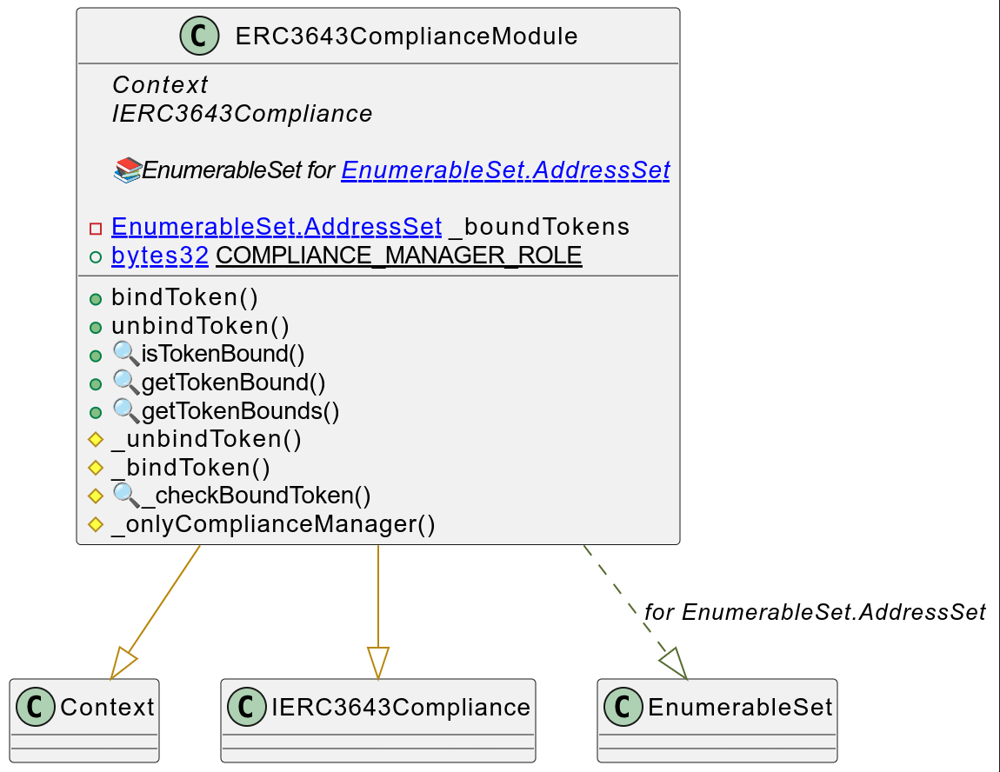
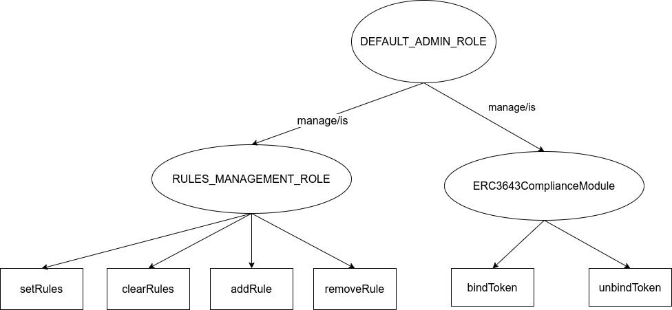
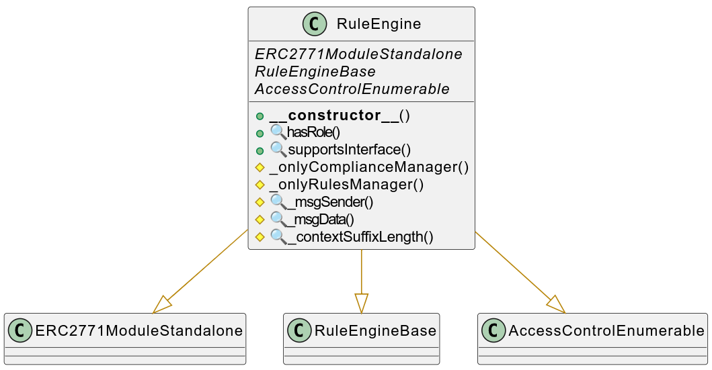
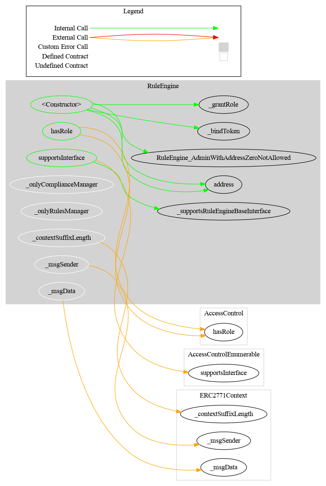
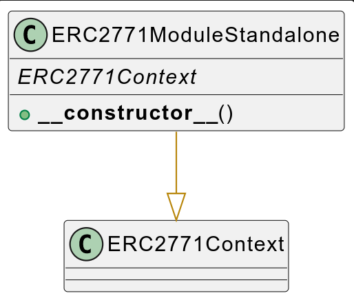
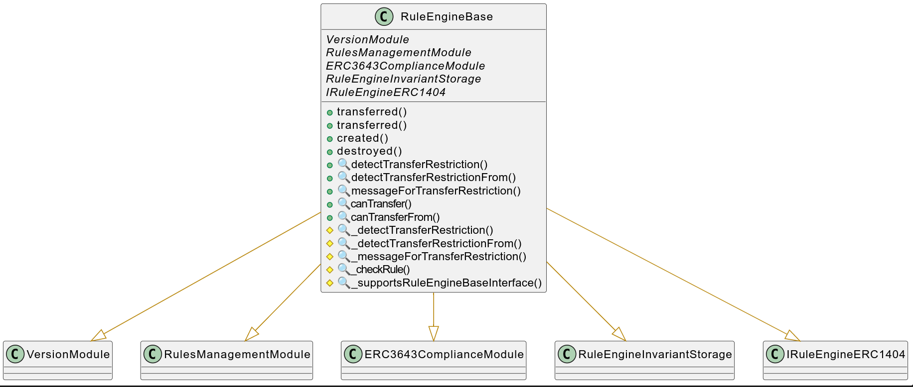
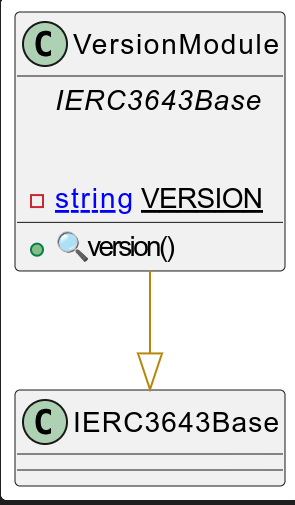
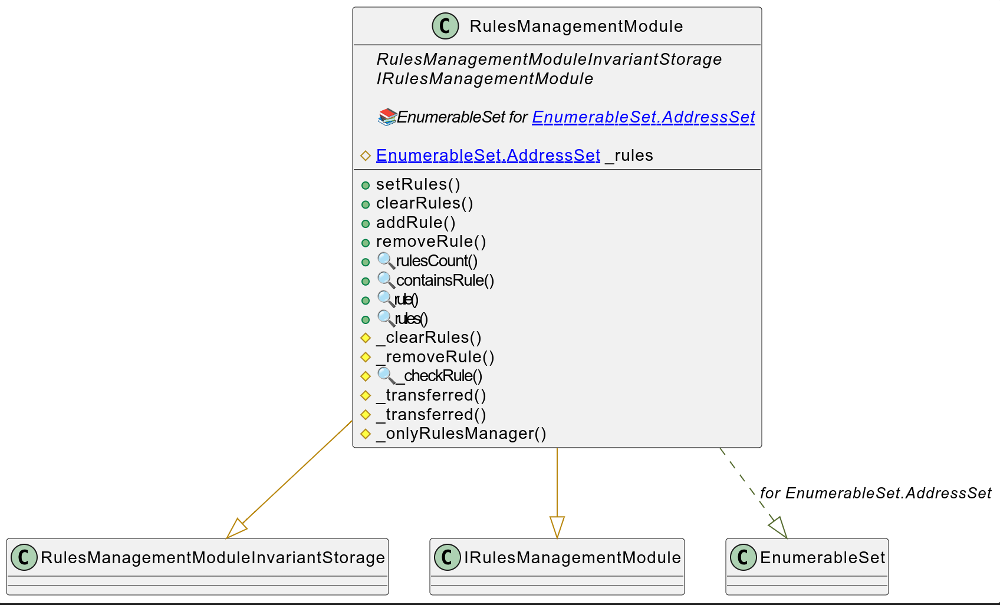
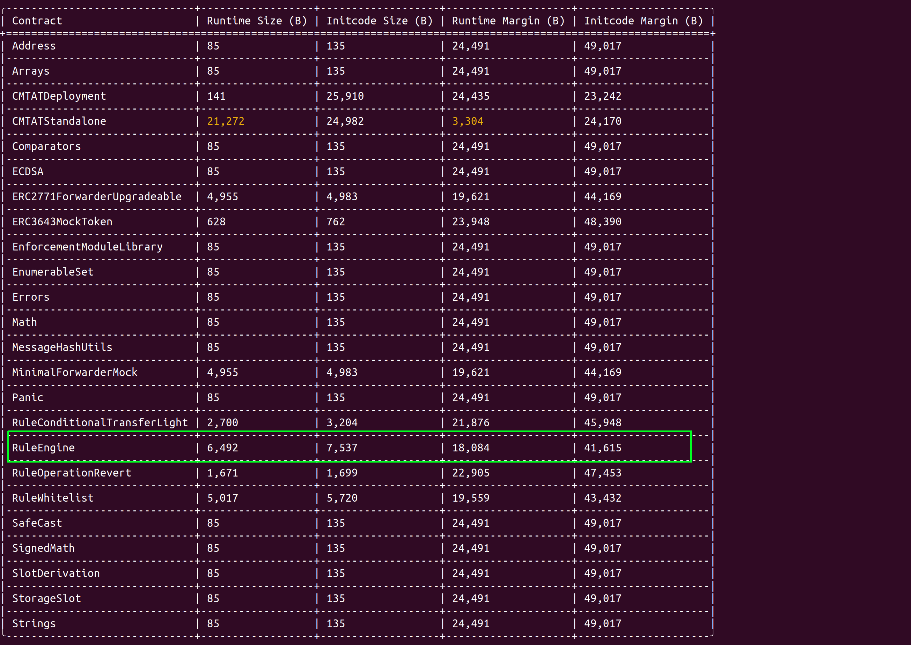
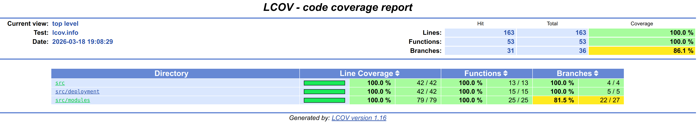

> To use the ruleEngine and the different rules, we recommend the latest audited version, from the [Releases](https://github.com/CMTA/CMTAT/releases) page. Currently, it is the version [v1.0.2](https://github.com/CMTA/RuleEngine/releases/tag/v1.0.2)

# RuleEngine

This repository includes the RuleEngine contract for [CMTAT](https://github.com/CMTA/CMTAT) and [ERC-3643](https://eips.ethereum.org/EIPS/eip-3643) tokens. 

The RuleEngine is an external contract used to apply transfer restrictions to another contract, such as CMTAT and ERC-3643 tokens. Acting as a controller, it can call different contract rules and apply these rules on each transfer.

## Motivation

- Why use a dedicated contract with rules instead of implementing it directly in CMTAT or [ERC-3643](https://eips.ethereum.org/EIPS/eip-3643) tokens?

There are several reasons to do this:

- Flexibility: These different features are not standard and common to all tokens. From an implementation perspective, using a rule engine with custom rules allows for each issuer or contract user to decide which rules to apply.

- Code efficiency: The CMTAT token (and generally also all ERC-3643 tokens) is currently "heavy," meaning its contract code size is close to the maximum limit. This makes it challenging to add new features directly inside the token contract.

- Reusability: 

  - We can use the RuleEngine inside other contracts besides CMTAT. For instance, the RuleEngine has been used it in [our contract to distribute dividends](https://www.taurushq.com/blog/equity-tokenization-how-to-pay-dividend-on-chain-using-cmtat/). 

  - A same deployed `RuleEngine`can also be used with several different tokens if the rules allowed it, which is the case for all ready-only rule.

Why use this `RuleEngine` contract instead of setting directly the `rule` in the token contract?

- Using a RuleEngine allows to call several different rules. For example, a blacklist rule to allow the issuer to manage its own list of blacklisted addresses and a sanctionlist rule to use the [Chainalysis oracle for sanctions screening](https://go.chainalysis.com/chainalysis-oracle-docs.html) to forbid transfers from addresses listed in sanctions designations by organizations such as the US, EU, or UN.

When the use of `RuleEngine` may not be appropriate?

If you plan to call only one rule (e.g a whitelist rule), it could make sense to directly set the rule in the token contract instead of using a RuleEngine. This will simplify configuration and reduce runtime gas costs.

## How it works

This diagram illustrates how a transfer with a CMTAT or ERC-3643 token with a RuleEngine works:


 

1. The token holders initiate a transfer transaction on the token contract.
2. The transfer function inside the token calls the ERC-3643 function `transferred` from the RuleEngine with the following parameters inside: `from, to, value`.
3. The Rule Engine calls each rule separately. If the transfer is not authorized by the rule, the rule must directly revert (no return value).

### How to set it

#### CMTAT v3.0.0

CMTAT provides the following function to set a RuleEngine inside a CMTAT token:

```solidity
 setRuleEngine(IRuleEngine ruleEngine_) 
```

This function is defined in the extension module `ValidationModuleRuleEngine`

#### ERC-3643 token

[ERC-3643](https://eips.ethereum.org/EIPS/eip-3643) defined the following function in the standard interface to set a compliance contract

```solidity
setCompliance(address _compliance)
```


## How to include it

While the RuleEngine has been designed for CMTAT and ERC-3643 tokens, it can be used with other contracts to apply transfer restrictions.

For that, the only thing to do is to import in your contract the interface `IRuleEngine`(CMTAT) or `IERC3643Compliance` (ERC-3643), which declares the corresponding functions to call by the token contract. This interface can be found [here](https://github.com/CMTA/CMTAT/blob/23a1e59f913d079d0c09d32fafbd95ab2d426093/contracts/interfaces/engine/IRuleEngine.sol).

### Like CMTAT

Before each ERC-20 transfer, the CMTAT calls the function `transferred` which is the entrypoint for the RuleEngine.

```solidity
function transferred(address from,address to,uint256 value)
```

If you want to apply restriction on the spender address, you have to call the `transferred` function which takes the spender argument in your ERC-20  function `transferFrom`.

```solidity
function transferred(address spender,address from,address to,uint256 value)
```

For example, CMTAT defines the interaction with the RuleEngine inside a specific module, [ValidationModuleRuleEngine](https://github.com/CMTA/CMTAT/blob/master/contracts/modules/wrapper/extensions/ValidationModule/ValidationModuleRuleEngine.sol) and [CMTATBaseRuleEngine](https://github.com/CMTA/CMTAT/blob/master/contracts/modules/1_CMTATBaseRuleEngine.sol).

- ValidationModuleRuleEngine


- CMTATBaseRuleEngine


This function `_transferred` is called before each transfer/burn/mint through the internal function `_checkTransferred` defined in [CMTAT_BASE](https://github.com/CMTA/CMTAT/blob/23a1e59f913d079d0c09d32fafbd95ab2d426093/contracts/modules/CMTAT_BASE.sol#L198).

### Like ERC-3643

The ERC-3643 defines several functions used as entrypoint for an ERC-3643 token.

They are the following:

```solidity
// read-only function
function canTransfer(address from, address to, uint256 value) external view returns (bool);
// ERC-20 transfer
function transferred(address from, address to, uint256 value) external;
// mint
function created(address to, uint256 value) external;
// burn
function destroyed(address from, uint256 value) external;
```

## Interface

### CMTAT

The `RuleEngine` base interface is defined in CMTAT repository.


It inherits from several others interface: `IERC1404Extend`, `IERC7551Compliance`, `IERC3643ComplianceContract`

```solidity
// IRuleEngine
function transferred(address spender, address from, address to, uint256 value) 
external;

// IERC-1404
function detectTransferRestriction(address from,address to,uint256 value) 
external view returns (uint8);

function messageForTransferRestriction(uint8 restrictionCode) 
external view returns (string memory);
    
// IERC-1404Extend    
enum REJECTED_CODE_BASE {
        TRANSFER_OK,
        TRANSFER_REJECTED_DEACTIVATED,
        TRANSFER_REJECTED_PAUSED,
        TRANSFER_REJECTED_FROM_FROZEN,
        TRANSFER_REJECTED_TO_FROZEN,
        TRANSFER_REJECTED_SPENDER_FROZEN,
        TRANSFER_REJECTED_FROM_INSUFFICIENT_ACTIVE_BALANCE
    }

function detectTransferRestrictionFrom(address spender,address from,address to,uint256 value) 
external view returns (uint8);
   
 
// IERC7551Compliance
function canTransferFrom(address spender,address from,address to,uint256 value)
external view returns (bool);


// IER3643ComplianceRead
function canTransfer(address from,address to,uint256 value) 
external view returns (bool isValid);

// IERC3643IComplianceContract
function transferred(address from, address to, uint256 value) 
external;
```


### ERC-3643

The [ERC-3643](https://eips.ethereum.org/EIPS/eip-3643) compliance interface is defined in [IERC3643Compliance.sol](src/interfaces/IERC3643Compliance.sol).


A specific module implements this interface for the RuleEngine: [ERC3643Compliance.sol](src/modules/ERC3643Compliance.sol)



## Technical

### Dependencies

The toolchain includes the following components, where the versions are the latest ones that we tested:

- Foundry (forge-std) [v1.10.0](https://github.com/foundry-rs/forge-std/releases/tag/v1.10.0)
- Solidity [0.8.30](https://docs.soliditylang.org/en/v0.8.30/) (via solc-js)
- OpenZeppelin Contracts (submodule) [v5.4.0](https://github.com/OpenZeppelin/openzeppelin-contracts/releases/tag/v5.4.0)
- CMTAT [v3.0.0-rc7](https://github.com/CMTA/CMTAT/releases/tag/v3.0.0-rc7)


### Contracts Description Table

### Access Control (RBAC)

CMTAT uses a RBAC access control by using the contract `AccessControl`from OpenZeppelin.

Each module defines the roles useful to restrict its functions.

The `AccessControlModule` which is used by all base and deployment contracts override the OpenZeppelin function `hasRole` to give by default all the roles to the `admin`.

See also [docs.openzeppelin.com - AccessControl](https://docs.openzeppelin.com/contracts/5.x/api/access#AccessControl)

#### Role list

Here is the list of roles and their 32 bytes identifier.

The default admin is the address put in argument(`admin`) inside the constructor. 

It is set in the constructor when the contract is deployed.

|                         | Defined in                       | 32 bytes identifier                                          |
| ----------------------- | -------------------------------- | ------------------------------------------------------------ |
| DEFAULT_ADMIN_ROLE      | OpenZeppelin<br />AccessControl  | 0x0000000000000000000000000000000000000000000000000000000000000000 |
| **Modules**             |                                  |                                                              |
| COMPLIANCE_MANAGER_ROLE | ERC3643Compliance                | 0xe5c50d0927e06141e032cb9a67e1d7092dc85c0b0825191f7e1cede600028568 |
| RULES_MANAGEMENT_ROLE   | RuleEngineInvariantStorageCommon | 0xea5f4eb72290e50c32abd6c23e45de3d8300b3286e1cbc2e293114b92e034e5e |


#### Schema

Here a schema of the Access Control.



#### Role by modules

Here a summary tab for each restricted functions defined in a module
For function signatures,  struct arguments are represented with their corresponding native type.

|                      | Function signature | Visibility [public/external] | Input variables (Function arguments) | Output variables<br />(return value) | Role Required |
| -------------------- | ------------------ | ---------------------------- | ------------------------------------ | ------------------------------------ | ------------- |
| **Modules**          |                    |                              |                                      |                                      |               |
| RulesManagementModule |                    |                              |                                      |                                      |               |
|                      | `setRules(address[] rules_)`                                 | public                       | `IRule[] rules_`                                         | -                                    | RULES_MANAGEMENT_ROLE     |
|                         | `clearRules()`                                               | public                              | - |-|RULES_MANAGEMENT_ROLE|
|                         | `addRule(address rule_)`                                     | public | `IRule rule_` |-|RULES_MANAGEMENT_ROLE|
|                         | `removeRule(address rule_)`                                  | public | `IRule rule_` |-|RULES_MANAGEMENT_ROLE|
| ERC3643ComplianceModule |  |                              |                                      |                                      |               |
|  | `bindToken(address token)` | public | `address token` | - | COMPLIANCE_MANAGER_ROLE |
|  | `unbindToken(address token)` | public | `address token` | - | COMPLIANCE_MANAGER_ROLE |
| RuleEngineBase |  | | | | |
|  | `transferred(address from,address to,uint256 value)` | public | `address from,address to, uint256 value` | - | onlyBoundToken (modifier) |
|  | `transferred(address spender,address from,address to,uint256 value)` | public | `address spender,address from,address to, uint256 value` | - | onlyBoundToken (modifier) |


### UML




### Graph




## Functionality

Several functionalities are not implemented because it makes more sense to directly implement them in the token smart contract

The RuleEngine can be removed from the main token contract by calling these dedicated functions

- CMTAT v3.0.0: `setRuleEngine(address ruleEngine)`
- ERC-3643 token: `setCompliance(address _compliance)`

### Available Rules

Rules have their own dedicated repository: [github.com/CMTA/Rules](https://github.com/CMTA/Rules)

The following rules are available:

| Rule                    | Type<br />[ready-only / read-write] | Audit planned                     | Description                                                  |
| ----------------------- | ----------------------------------- | --------------------------------- | ------------------------------------------------------------ |
| RuleWhitelist           | Ready-only                          | &#x2611;                          | This rule can be used to restrict transfers from/to only addresses inside a whitelist. |
| RuleWhitelistWrapper    | Ready-only                          | &#x2611;                          | This rule can be used to restrict transfers from/to only addresses inside a group of whitelist rules managed by different operators. |
| RuleBlacklist           | Ready-only                          | &#x2611;                          | This rule can be used to forbid transfer from/to addresses in the blacklist |
| RuleSanctionList        | Ready-only                          | &#x2611;                          | The purpose of this contract is to use the oracle contract from Chainalysis to forbid transfer from/to an address  included in a sanctions designation (US, EU, or UN). |
| RuleConditionalTransfer | Ready-Write                         | &#x2612;<br />(experimental rule) | This rule requires that transfers have to be approved before being executed by the token holders. |


### Gasless support (ERC-2771)



The RuleEngine supports client-side gasless transactions using the standard [ERC-2771](https://eips.ethereum.org/EIPS/eip-2771).

The contract uses the OpenZeppelin contract `ERC2771ContextUpgradeable`, which allows a contract to get the original client with `_msgSender()` instead of the feepayer given by `msg.sender`.

At deployment, the parameter  `forwarder` inside the RuleEngine contract constructor has to be set  with the defined address of the forwarder. 

After deployment, the forwarder is immutable and can not be changed.

References:

- [OpenZeppelin Meta Transactions](https://docs.openzeppelin.com/contracts/5.x/api/metatx)

- OpenGSN has deployed several forwarders, see their [documentation](https://docs.opengsn.org/contracts/#receiving-a-relayed-call) to see some examples.

### Upgradeable

A proxy architecture (upgradeable) increases the code complexity as well as the runtime gas cost for each transaction. This is why the RuleEngine is not upgradeable.

Moreover, in a proxy architecture, each new implementation must be compatible (storage) with the precedent implementation, which can reduce the ability to improve the code.

In case you use the same RuleEngine for several different tokens, unfortunately, you will have to update the address of the RuleEngine set in each token contract separately. 

### Urgency mechanism

#### Pause

There are no functionalities to put in pause the RuleEngine. 

The RuleEngine can be removed from the main token contract by calling the dedicated functions to manage the RuleEngine

#### Kill / Deactivate the contracts

There are no functionalities to kill/deactivate the contracts.

Similar to the pause functionality, the RuleEngine can be directly removed from the main token contract.

## Ethereum API

### RuleEngineBase



#### IRuleEngine


##### transferred(address spender, address from, address to, uint256 value)

```solidity
function transferred(address spender,address from,address to,uint256 value) 
public virtual override(IRuleEngine) 
onlyBoundToken
```

Function called whenever tokens are transferred from one wallet to another.

Must revert if the transfer is invalid.
 Same name as ERC-3643 but with an additional `spender` parameter.
 This function can be used to update state variables of the RuleEngine contract.
 Can only be called by the token contract bound to the RuleEngine.

**Input Parameters:**

| Name    | Type    | Description                                    |
| ------- | ------- | ---------------------------------------------- |
| spender | address | The spender address initiating the transfer.   |
| from    | address | The token holder address.                      |
| to      | address | The receiver address.                          |
| value   | uint256 | The amount of tokens involved in the transfer. |

#### IERC7551Compliance


##### canTransferFrom(address spender, address from, address to, uint256 value) -> bool

Checks if `spender` can transfer `value` tokens from `from` to `to` under compliance rules.

Does not check balances or access rights (Access Control).

**Input Parameters:**

| Name    | Type    | Description                          |
| ------- | ------- | ------------------------------------ |
| spender | address | The address performing the transfer. |
| from    | address | The source address.                  |
| to      | address | The destination address.             |
| value   | uint256 | The number of tokens to transfer.    |


**Return Values:**

| Type | Description                                |
| ---- | ------------------------------------------ |
| bool | True if the transfer complies with policy. |

#### IERC3643ComplianceRead


------

##### canTransfer(address from, address to, uint256 value) -> bool

Returns true if the transfer is valid, and false otherwise.

Does not check balances or access rights (Access Control).

**Input Parameters:**

| Name  | Type    | Description                       |
| ----- | ------- | --------------------------------- |
| from  | address | The source address.               |
| to    | address | The destination address.          |
| value | uint256 | The number of tokens to transfer. |


**Return Values:**

| Type | Description                                     |
| ---- | ----------------------------------------------- |
| bool | True if the transfer is valid, false otherwise. |

#### IERC3643IComplianceContract


------

##### transferred(address from, address to, uint256 value)

```solidity
function transferred(address from,address to,uint256 value) 
public virtual override(IERC3643IComplianceContract) 
onlyBoundToken
```

Updates the compliance contract state whenever tokens are transferred.

Can only be called by the token contract bound to this compliance logic.
 This function can be used to update internal state variables.

**Input Parameters:**

| Name  | Type    | Description                                    |
| ----- | ------- | ---------------------------------------------- |
| from  | address | The address of the sender.                     |
| to    | address | The address of the receiver.                   |
| value | uint256 | The number of tokens involved in the transfer. |


#### IERC3643Compliance

------

##### created(address to, uint256 value)

```solidity
function created(address to, uint256 value) 
public virtual override(IERC3643Compliance) 
onlyBoundToken
```

Updates the compliance contract state when tokens are created (minted).

Called by the token contract when new tokens are issued to an account.
 Reverts if the minting does not comply with the rules.

**Input Parameters:**

| Name  | Type    | Description                              |
| ----- | ------- | ---------------------------------------- |
| to    | address | The address receiving the minted tokens. |
| value | uint256 | The number of tokens created.            |


------

##### destroyed(address from, uint256 value)

```solidity
function destroyed(address from, uint256 value) 
public virtual override(IERC3643Compliance) 
onlyBoundToken 
```

Updates the compliance contract state when tokens are destroyed (burned).

Called by the token contract when tokens are redeemed or burned.
 Reverts if the burning does not comply with the rules.

**Input Parameters:**

| Name  | Type    | Description                                   |
| ----- | ------- | --------------------------------------------- |
| from  | address | The address whose tokens are being destroyed. |
| value | uint256 | The number of tokens destroyed.               |


#### IERC1404


------

##### detectTransferRestriction(address from, address to, uint256 value) -> uint8

Returns a uint8 code to indicate if a transfer is restricted or not.

Implements the restriction logic of {ERC-1404}.
 Examples of restriction logic include:

- checking if the recipient is whitelisted,
- checking if the sender’s tokens are frozen during a lock-up period, etc.

**Input Parameters:**

| Name  | Type    | Description                       |
| ----- | ------- | --------------------------------- |
| from  | address | The source address.               |
| to    | address | The destination address.          |
| value | uint256 | The number of tokens to transfer. |


**Return Values:**

| Type  | Description                                            |
| ----- | ------------------------------------------------------ |
| uint8 | Restriction code (0 means the transfer is authorized). |


------

##### messageForTransferRestriction(uint8 restrictionCode) -> string

Returns a human-readable explanation for a transfer restriction code.

Implements {ERC-1404} standard message accessor.

**Input Parameters:**

| Name            | Type  | Description                        |
| --------------- | ----- | ---------------------------------- |
| restrictionCode | uint8 | The restriction code to interpret. |


**Return Values:**

| Type   | Description                                          |
| ------ | ---------------------------------------------------- |
| string | A message describing why the transfer is restricted. |


------

#### IERC1404Extend


##### enum REJECTED_CODE_BASE

Error codes for transfer restrictions.
 Codes `6–9` are reserved for future CMTAT ruleEngine extensions.

| Name                                               | Value | Description                                                  |
| -------------------------------------------------- | ----- | ------------------------------------------------------------ |
| TRANSFER_OK                                        | 0     | Transfer authorized.                                         |
| TRANSFER_REJECTED_PAUSED                           | 1     | Transfer rejected because the token is paused.               |
| TRANSFER_REJECTED_FROM_FROZEN                      | 2     | Transfer rejected because the sender’s address is frozen.    |
| TRANSFER_REJECTED_TO_FROZEN                        | 3     | Transfer rejected because the recipient’s address is frozen. |
| TRANSFER_REJECTED_SPENDER_FROZEN                   | 4     | Transfer rejected because the spender’s address is frozen.   |
| TRANSFER_REJECTED_FROM_INSUFFICIENT_ACTIVE_BALANCE | 5     | Transfer rejected because the sender does not have enough active (unfrozen) balance. |


------

##### detectTransferRestrictionFrom(address spender, address from, address to, uint256 value) -> uint8

Returns a uint8 code to indicate if a transfer is restricted or not.

This is an extension of {ERC-1404} with an additional `spender` parameter to enforce restriction logic on delegated transfers.
 Examples of restriction logic include:

- verifying if the recipient is whitelisted,
- verifying if tokens are locked for either sender or spender, etc.

**Input Parameters:**

| Name    | Type    | Description                                                  |
| ------- | ------- | ------------------------------------------------------------ |
| spender | address | The address initiating the transfer (for delegated transfers). |
| from    | address | The source address.                                          |
| to      | address | The destination address.                                     |
| value   | uint256 | The number of tokens to transfer.                            |


**Return Values:**

| Type  | Description                                            |
| ----- | ------------------------------------------------------ |
| uint8 | Restriction code (0 means the transfer is authorized). |


------

### VersionModule



#### version()

```solidity
function version() external view returns (string memory version_);
```

```solidity
function version() 
public view virtual override(IERC3643Base) 
returns (string memory version_)
```

 **Description**

Returns the current version of the token contract.
Useful for identifying which version of the smart contract is deployed and in use. 

**Return**

| Name       | Type   | Description                                                  |
| ---------- | ------ | ------------------------------------------------------------ |
| `version_` | string | The version string of the token implementation (e.g., "1.0.0"). |


### ERC3643ComplianceModule


#### Events

##### TokenBound(address token)

```solidity
event TokenBound(address token)
```

Emitted when a token is successfully bound to the compliance contract.

**Event Parameters:**

| Name  | Type    | Description                              |
| ----- | ------- | ---------------------------------------- |
| token | address | The address of the token that was bound. |


------

##### TokenUnbound(address token)

```solidity
event TokenUnbound(address token)
```

Emitted when a token is successfully unbound from the compliance contract.

**Event Parameters:**

| Name  | Type    | Description                                |
| ----- | ------- | ------------------------------------------ |
| token | address | The address of the token that was unbound. |


------

#### Functions

##### bindToken(address token)

```solidity
function bindToken(address token) 
public override virtual 
onlyRole(COMPLIANCE_MANAGER_ROLE)
```

Associates a token contract with this compliance contract.

The compliance contract may restrict operations on the bound token according to its internal compliance logic.
 Reverts if the token is already bound.

**Input Parameters:**

| Name  | Type    | Description                       |
| ----- | ------- | --------------------------------- |
| token | address | The address of the token to bind. |


------

##### unbindToken(address token)

```solidity
function unbindToken(address token) 
public override virtual 
onlyRole(COMPLIANCE_MANAGER_ROLE)
```

Removes the association of a token contract from this compliance contract.

Reverts if the token is not currently bound.

**Input Parameters:**

| Name  | Type    | Description                         |
| ----- | ------- | ----------------------------------- |
| token | address | The address of the token to unbind. |


------

##### isTokenBound(address token) -> bool

```solidity
function isTokenBound(address token) 
public view virtual override 
returns (bool)
```

Checks whether a token is currently bound to this compliance contract.

**Input Parameters:**

| Name  | Type    | Description                  |
| ----- | ------- | ---------------------------- |
| token | address | The token address to verify. |


**Return Values:**

| Type | Description                                  |
| ---- | -------------------------------------------- |
| bool | True if the token is bound, false otherwise. |


------

#####  getTokenBound() -> address

```solidity
function getTokenBound() 
public view virtual override 
returns (address)
```

Returns the single token currently bound to this compliance contract.

If multiple tokens are supported, consider using `getTokenBounds()`.

Note that there are no guarantees on the ordering of values inside the array, and it may change when more values are added or removed.

**Return Values:**

| Type    | Description                               |
| ------- | ----------------------------------------- |
| address | The address of the currently bound token. |


------

##### getTokenBounds() -> address[]

```solidity
function getTokenBounds() 
public view override 
returns (address[] memory)
```

Returns all tokens currently bound to this compliance contract.

This is a view-only function and does not modify state.
This function is not part of the original ERC-3643 specification.

This operation will copy the entire storage to memory, which can be quite expensive. 

This is designed to mostly be used by view accessors that are queried without any gas fees.

**Return Values:**

| Type      | Description                                     |
| --------- | ----------------------------------------------- |
| address[] | An array of addresses of bound token contracts. |


### RulesManagementModule



#### Events

#### event AddRule(address rule)

```solidity
event AddRule(IRule indexed rule)
```

Emitted when a new rule is added to the rule set.

**Event Parameters:**

| Name | Type  | Description                                      |
| ---- | ----- | ------------------------------------------------ |
| rule | IRule | The address of the rule contract that was added. |

------

#### event RemoveRule(address rule)

```solidity
event RemoveRule(IRule indexed rule)
```

Emitted when a rule is removed from the rule set.

**Event Parameters:**

| Name | Type  | Description                                        |
| ---- | ----- | -------------------------------------------------- |
| rule | IRule | The address of the rule contract that was removed. |

------

#### event ClearRules()

```solidity
event ClearRules()
```

Emitted when all rules are cleared from the rule set.

This event has no parameters.

#### Functions

##### setRules(address[] rules_)

```solidity
function setRules(IRule[] calldata rules_) 
public virtual override(IRulesManagementModule) 
onlyRole(RULES_MANAGEMENT_ROLE)
```

Defines the complete list of rules for the rule engine.

Any previously configured rules are completely replaced.
 Rules must be deployed contracts implementing the expected `IRule` interface.
 Reverts if any rule address is zero or if duplicates are detected.

This function calls _clearRules if at least one rule is still configured

**Input Parameters:**

| Name   | Type    | Description                                                  |
| ------ | ------- | ------------------------------------------------------------ |
| rules_ | IRule[] | The array of IRule contracts to configure as the active rules. |


------

##### rulesCount() -> uint256

```solidity
function rulesCount() 
public view virtual override(IRulesManagementModule) 
returns (uint256)
```

Returns the total number of currently configured rules.

Equivalent to the length of the internal rules array.

**Return Values:**

| Type    | Description                 |
| ------- | --------------------------- |
| uint256 | The number of active rules. |


------

##### rule(uint256 ruleId) -> address

```solidity
function rule(uint256 ruleId) 
public view virtual override(IRulesManagementModule) 
returns (address)
```

Retrieves the rule address at a specific index.

Return the`zero address` is out of bounds.

Note that there are no guarantees on the ordering of values inside the array, and it may change when more values are added or removed.

**Input Parameters:**

| Name   | Type    | Description                                 |
| ------ | ------- | ------------------------------------------- |
| ruleId | uint256 | The index of the desired rule in the array. |


**Return Values:**

| Type    | Description                                      |
| ------- | ------------------------------------------------ |
| address | The address of the corresponding IRule contract. |


------

##### rules() -> address[]

```solidity
function rules()
public view virtual override(IRulesManagementModule)
returns (address[] memory)
```

Returns the full list of currently configured rules.

This is a view-only function and does not modify state.

This operation will copy the entire storage to memory, which can be quite expensive. 

This is designed to mostly be used by view accessors that are queried without any gas fees.

**Return Values:**

| Type      | Description                                             |
| --------- | ------------------------------------------------------- |
| address[] | An array containing all active rule contract addresses. |


------

##### clearRules() 

```solidity
function clearRules() 
public virtual override(IRulesManagementModule) 
onlyRole(RULES_MANAGEMENT_ROLE)
```

Removes all configured rules.

After calling this function, no rules will remain set.

Developers should keep in mind that this function has an unbounded cost and using it may render the function uncallable if the set grows to the point where clearing it consumes too much gas to fit in a block.

------

##### addRule(address rule_) 

```solidity
function addRule(IRule rule_) 
public virtual override(IRulesManagementModule) 
onlyRole(RULES_MANAGEMENT_ROLE)
```

Adds a new rule to the current rule set.

Reverts if the rule address is zero or already exists in the set.

**Input Parameters:**

| Name  | Type  | Description                |
| ----- | ----- | -------------------------- |
| rule_ | IRule | The IRule contract to add. |


------

##### removeRule(address rule_)

```solidity
 function removeRule(IRule rule_) 
 public virtual 
 override(IRulesManagementModule) 
 onlyRole(RULES_MANAGEMENT_ROLE)
```

Removes a specific rule from the current rule set.

Reverts if the provided rule is not found or does not match the stored rule at its index.

**Input Parameters:**

| Name  | Type  | Description                   |
| ----- | ----- | ----------------------------- |
| rule_ | IRule | The IRule contract to remove. |


------

##### containsRule(address rule_) -> bool

```solidity
function containsRule(IRule rule_) 
public view virtual override(IRulesManagementModule) 
returns (bool)
```

Checks whether a specific rule is currently configured.

**Input Parameters:**

| Name  | Type  | Description                                 |
| ----- | ----- | ------------------------------------------- |
| rule_ | IRule | The IRule contract to check for membership. |


**Return Values:**

| Type | Description                                   |
| ---- | --------------------------------------------- |
| bool | True if the rule is present, false otherwise. |

## Security

### Vulnerability disclosure

Please see [SECURITY.md](https://github.com/CMTA/CMTAT/blob/master/SECURITY.md) (CMTAT main repository).

The contracts have been audited by [ABDKConsulting](https://www.abdk.consulting/), a globally recognized firm specialized in smart contracts' security.

### Audit

#### First Audit - March 2022

Fixed version : [v1.0.2](https://github.com/CMTA/RuleEngine/releases/tag/v1.0.2)

The first audit was performed by ABDK on the version [1.0.1](https://github.com/CMTA/RuleEngine/releases/tag/1.0.1).

The release [v1.0.2](https://github.com/CMTA/RuleEngine/releases/tag/v1.0.2) contains the different fixes and improvements related to this audit.

The temporary report is available in [Taurus. Audit 3.3.CollectedIssues.ods](doc/audits/Taurus.Audit3.3.CollectedIssues.ods) 

The final report is available in [ABDK_CMTA_CMTATRuleEngine_v_1_0.pdf](https://github.com/CMTA/CMTAT/blob/master/doc/audits/ABDK_CMTA_CMTATRuleEngine_v_1_0/ABDK_CMTA_CMTATRuleEngine_v_1_0.pdf).

### Tools

#### Slither

Here is the list of report performed with [Slither](https://github.com/crytic/slither)

| Version | File                                                         |
| ------- | ------------------------------------------------------------ |
| latest  | [slither-report.md](./doc/security/audits/tools/slither-report.md) |

```bash
slither .  --checklist --filter-paths "openzeppelin-contracts|test|CMTAT|forge-std|mocks" > slither-report.md
```


#### Aderyn

Here is the list of report performed with [Aderyn](https://github.com/Cyfrin/aderyn)

```bash
aderyn -x mocks --output aderyn-report.md
```

| Version | File                                                         |
| ------- | ------------------------------------------------------------ |
| latest  | [aderyn-report.md](./doc/security/audits/tools/aderyn-report.md) |

## Documentation

Here a summary of the main documentation

| Document     | Link/Files                              |
| ------------ | --------------------------------------- |
| Toolchain    | [doc/TOOLCHAIN.md](./doc/TOOLCHAIN.md)  |
| Surya report | [doc/schema/surya](./doc/schema/surya/) |

See also [Taurus - Token Transfer Management: How to Apply Restrictions with CMTAT and ERC-1404](https://www.taurushq.com/blog/token-transfer-management-how-to-apply-restrictions-with-cmtat-and-erc-1404/) (RuleEngine v2.02 and CMTAT v2.4.0)

## Toolchains and Usage

*Explain how it works.*

### Configuration

Here are the settings for [Hardhat](https://hardhat.org) and [Foundry](https://getfoundry.sh).

- `hardhat.config.js`
  - Solidity [v0.8.30](https://docs.soliditylang.org/en/v0.8.30/)
  - EVM version: Prague (Pectra upgrade)
  - Optimizer: true, 200 runs

- `foundry.toml`
  - Solidity [v0.8.30](https://docs.soliditylang.org/en/v0.8.30/)
  - EVM version: Prague (Pectra upgrade)
  - Optimizer: true, 200 runs


### Toolchain installation
The contracts are developed and tested with [Foundry](https://book.getfoundry.sh), a smart contract development toolchain.

To install the Foundry suite, please refer to the official instructions in the [Foundry book](https://book.getfoundry.sh/getting-started/installation).

### Initialization

You must first initialize the submodules, with

```
forge install
```

See also the command's [documentation](https://book.getfoundry.sh/reference/forge/forge-install).

Later you can update all the submodules with:

```
forge update
```

See also the command's [documentation](https://book.getfoundry.sh/reference/forge/forge-update).

### Compilation

The official documentation is available in the Foundry [website](https://book.getfoundry.sh/reference/forge/build-commands) 
```
 forge build --contracts src/RuleEngine.sol
```
### Contract size

```bash
 forge compile --sizes
```




### Testing

You can run the tests with

```bash
forge test
```

To run a specific test, use

```bash
forge test --match-contract <contract name> --match-test <function name>
```

Generate gas report

```bash
forge test --gas-report
```

See also the test framework's [official documentation](https://book.getfoundry.sh/forge/tests), and that of the [test commands](https://book.getfoundry.sh/reference/forge/test-commands).

### Coverage

A code coverage is available in [index.html](./doc/coverage/coverage/index.html).



* Perform a code coverage
```
forge coverage
```

* Generate LCOV report
```
forge coverage --report lcov
```

- Generate `index.html`

```bash
forge coverage --no-match-coverage "(script|mocks|test)" --report lcov && genhtml lcov.info --branch-coverage --output-dir coverage
```

See [Solidity Coverage in VS Code with Foundry](https://mirror.xyz/devanon.eth/RrDvKPnlD-pmpuW7hQeR5wWdVjklrpOgPCOA-PJkWFU) & [Foundry forge coverage](https://www.rareskills.io/post/foundry-forge-coverage)

### Deployment
The official documentation is available in the Foundry [website](https://getfoundry.sh/forge/deploying) 
#### Script

> This documentation has been written for the version v1.0.2

To run the script for deployment, you need to create a .env file. The value for CMTAT.ADDRESS is require only to use the script **RuleEngine.s.sol**
Warning : put your private key in a .env file is not the best secure way.

* File .env
```
PRIVATE_KEY=<YOUR_PRIVATE_KEY>
CMTAT_ADDRESS=<CMTAT ADDDRESS
```
* Command

CMTAT with RuleEngine

```bash
forge script script/CMTATWithRuleEngineScript.s.sol:CMTATWithRuleEngineScript --rpc-url=$RPC_URL  --broadcast --verify -vvv
```


- Value of YOUR_RPC_URL with a local instance of anvil : [127.0.0.1:8545](http://127.0.0.1:8545)

```bash
forge script script/CMTATWithRuleEngineScript.s.sol:CMTATWithRuleEngineScript --rpc-url=127.0.0.1:8545  --broadcast --verify -vvv
```

Only RuleEngine with a Whitelist contract

```bash
forge script script/RuleEngineScript.s.sol:RuleEngineScript --rpc-url=$RPC_URL  --broadcast --verify -vvv
```

- With anvil

```bash
forge script script/RuleEngineScript.s.sol:RuleEngineScript --rpc-url=127.0.0.1:8545  --broadcast --verify -vvv
```

### Solidity style guideline

RuleEngine follows the [solidity style guideline](https://docs.soliditylang.org/en/latest/style-guide.html) and the [natspec format](https://docs.soliditylang.org/en/latest/natspec-format.html) for comments

- Orders of Functions

Functions are grouped according to their visibility and ordered:

```
1. constructor

2. receive function (if exists)

3. fallback function (if exists)

4. external

5. public

6. internal

7. private
```

Within a grouping, place the `view` and `pure` functions last

- Function declaration

```
1. Visibility
2. Mutability
3. Virtual
4. Override
5. Custom modifiers
```

## Intellectual property

The code is copyright (c) Capital Market and Technology Association, 2022-2025, and is released under [Mozilla Public License 2.0](https://github.com/CMTA/CMTAT/blob/master/LICENSE.md).
