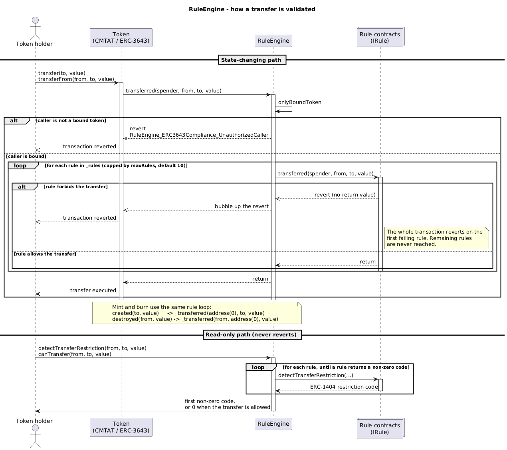

> This project has not undergone an audit and is provided as-is without any warranties.

# RuleEngine

RuleEngine applies transfer restrictions to [CMTAT](https://github.com/CMTA/CMTAT) and [ERC-3643](https://eips.ethereum.org/EIPS/eip-3643) tokens.

It is an *external controller*: the token calls the engine on every transfer, mint and burn, and the engine forwards the call to a configurable list of pluggable rule contracts. This keeps compliance logic out of the token, lets each issuer compose the rules they need, and avoids growing the token's already large bytecode.

- **Version:** 3.0.0
- **Solidity:** ^0.8.20 (compiled with 0.8.36)
- **EVM target:** Prague
- **License:** MPL-2.0

**Full documentation: [doc/README.md](./doc/README.md)** — interfaces, Ethereum API, deployment, UML and call graphs, audits, and toolchain usage.

## Contract Variants

Three deployable contracts share the same core logic and differ only in access control:

| Contract | Access Control | Use Case |
|----------|---------------|----------|
| `RuleEngine` | Role-based (`AccessControlEnumerable`) | Multi-operator environments with granular permissions |
| `RuleEngineOwnable` | ERC-173 `Ownable` | Single-owner setups, simpler administration |
| `RuleEngineOwnable2Step` | ERC-173 `Ownable2Step` | Single-owner setups with safer ownership handover |

All three support ERC-1404 transfer restrictions, the ERC-3643 compliance interface, ERC-2771 meta-transactions (gasless), and multiple token bindings.

> **Warning (shared engine across multiple tokens):** one RuleEngine instance can be bound to several tokens, but they must be equally trusted and governed together. ERC-3643 callbacks do not pass the token address to rules, so stateful rules are not safe for mutually untrusted tokens sharing an engine.

## How it works



The token calls `transferred(...)` on the engine, which checks the caller is a bound token and then runs each configured rule in order. A rule that forbids the transfer reverts, and the whole transaction reverts with it — remaining rules are never reached.

CMTAT selects the overload on whether there is a spender: a plain `transfer` passes `address(0)` and therefore uses the 3-argument `transferred(from, to, value)`, while `transferFrom`, `mint` and `burn` pass `_msgSender()` and use the 4-argument `transferred(spender, from, to, value)`. ERC-3643 tokens instead call the dedicated `created` / `destroyed` entry points, which run the same rule loop without a spender.

The view path, `detectTransferRestriction()`, iterates the same rules and returns the first non-zero ERC-1404 restriction code instead of reverting.

_Diagram source: [doc/schema/plantuml/ruleengine-transfer-flow.puml](./doc/schema/plantuml/ruleengine-transfer-flow.puml)._

## Architecture

```
RuleEngineBase (abstract)          — core logic, shared by all variants
├── VersionModule                  — version()
├── RulesManagementModule          — add/remove/set/clear rules, maxRules cap
├── ERC3643ComplianceExtendedModule
│   └── ERC3643ComplianceModule    — bind/unbind tokens, compliance hooks
└── IRuleEngineERC1404             — CMTAT interface

RuleEngine               = RuleEngineBase + AccessControl + ERC2771ModuleStandalone
RuleEngineOwnable        = RuleEngineOwnableShared + Ownable      + ERC2771ModuleStandalone
RuleEngineOwnable2Step   = RuleEngineOwnableShared + Ownable2Step + ERC2771ModuleStandalone
```

Modules declare access control as **virtual internal hooks** (`_onlyRulesManager`, `_onlyComplianceManager`, `_onlyRulesLimitManager`); each deployable contract overrides them with either RBAC roles or `onlyOwner`. Rules and bound tokens are stored in OpenZeppelin `EnumerableSet.AddressSet` for O(1) add/remove/contains plus iteration.

## Repository layout

```
src/
├── RuleEngineBase.sol              # abstract core logic (not deployable)
├── RuleEngineOwnableShared.sol     # shared logic for the two ownable variants
├── deployment/                     # the three deployable contracts
│   ├── RuleEngine.sol
│   ├── RuleEngineOwnable.sol
│   └── RuleEngineOwnable2Step.sol
├── interfaces/                     # IRule, IRulesManagementModule, IERC3643Compliance(Extended)
├── modules/                        # VersionModule, RulesManagementModule,
│   │                               # ERC3643Compliance(Extended)Module, ERC2771ModuleStandalone
│   └── library/                    # invariant storage (errors/events), role constants, interface IDs
└── mocks/                          # reference rules and test doubles — not for production

test/                               # Foundry tests, one directory per deployable variant
script/                             # Foundry deployment / example scripts
doc/                                # full documentation, schemas, coverage, audits
```

**Key invariant:** rule contracts under `src/mocks/` are reference implementations for testing and examples. Production rules live in a separate repository.

## Rules

Production rules are maintained at [github.com/CMTA/Rules](https://github.com/CMTA/Rules), in two families:

- **Validation rules (read-only)** — evaluate eligibility without mutating state: `RuleWhitelist`, `RuleBlacklist`, `RuleSanctionList`, `RuleIdentityRegistry`, `RuleSpenderWhitelist`, `RuleERC2980`, `RuleMaxTotalSupply`
- **Operation rules (read-write)** — may update rule state on transfer: `RuleConditionalTransferLight`

To be usable by the engine, a rule must implement `IRule` and advertise it through ERC-165. Restriction codes should stay unique across the composed rule set.

## Quick start

Dependencies are git submodules.

```bash
git submodule update --init --recursive   # or: forge install
cd lib/CMTAT && npm install && cd ../..   # CMTAT's own OpenZeppelin deps

forge build       # compile
forge test        # run the test suite
forge coverage    # code coverage
forge fmt         # format
```

See [doc/README.md](./doc/README.md) for deployment scripts, the production deployment checklist, and Hardhat usage.

## Security

- Vulnerability disclosure: [SECURITY.md](https://github.com/CMTA/CMTAT/blob/master/SECURITY.md) (CMTAT main repository)
- v1.0.2 was audited by [ABDK Consulting](https://www.abdk.consulting/) in March 2022; the current 3.0.0 line has **not** been audited
- Static-analysis reports (Slither, Aderyn, Nethermind AuditAgent) are in [doc/security](./doc/security/)

## Intellectual property

The code is copyright (c) Capital Market and Technology Association, 2022-2026, and is released under [Mozilla Public License 2.0](https://github.com/CMTA/CMTAT/blob/master/LICENSE.md).
