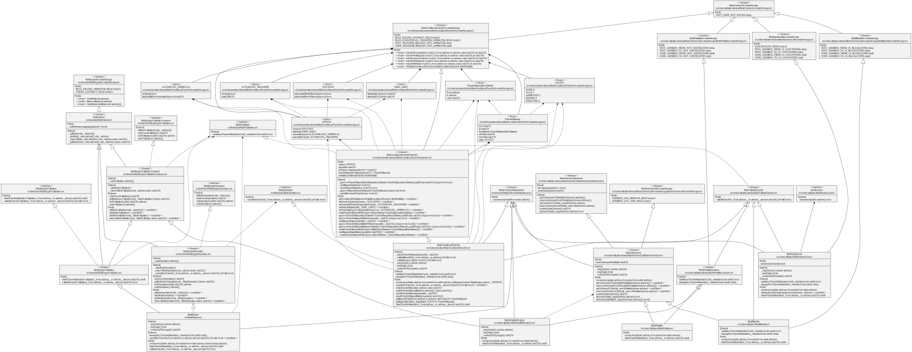

> To use the ruleEngine and the different rules, we recommend the latest audited version, from the [Releases](https://github.com/CMTA/CMTAT/releases) page. Currently, it is the version [v1.0.2](https://github.com/CMTA/RuleEngine/releases/tag/v1.0.2)

# RuleEngine

This repository includes the RuleEngine contract for [CMTAT](https://github.com/CMTA/CMTAT) and [ERC-3643](https://eips.ethereum.org/EIPS/eip-3643) tokens. 

The RuleEngine is an external contract used to apply transfer restrictions to another contract, such as CMTAT and ERC-3643 tokens. Acting as a controller, it can call different contract rules and apply these rules on each transfer.

## Interface

### CMTAT

The RuleEngine base interface is defined in CMTAT reposotiry.


It inherits from several others interace:

- IERC1404 which contains ERC-1404 related functions

```solidity
    function detectTransferRestriction(
        address from,
        address to,
        uint256 value
    ) external view returns (uint8);

    function messageForTransferRestriction(
        uint8 restrictionCode
    ) external view returns (string memory);
```


```
enum REJECTED_CODE_BASE {
        TRANSFER_OK,
        TRANSFER_REJECTED_DEACTIVATED,
        TRANSFER_REJECTED_PAUSED,
        TRANSFER_REJECTED_FROM_FROZEN,
        TRANSFER_REJECTED_TO_FROZEN,
        TRANSFER_REJECTED_SPENDER_FROZEN,
        TRANSFER_REJECTED_FROM_INSUFFICIENT_ACTIVE_BALANCE
    }

    function detectTransferRestrictionFrom(
        address spender,
        address from,
        address to,
        uint256 value
    ) external view returns (uint8);
```


- IERC7551Compliance which includes function related to ERC-7551:

```
 function canTransferFrom(address spender,address from,address to,uint256 value)  external view returns (bool);
```


- canTransfer

```
 function canTransfer(address from,address to,uint256 value) external view returns (bool isValid);
```


- IERC3643IComplianceContract

```
 function transferred(address from, address to, uint256 value) external;
```


### ERC-3643


## Dependencies

The toolchain includes the following components, where the versions are the latest ones that we tested:

- Foundry [v1.9.4](https://github.com/foundry-rs/forge-std/releases/tag/v1.9.4)
- Solidity 0.8.30 (via solc-js)
- OpenZeppelin Contracts (submodule) [v5.3.0](https://github.com/OpenZeppelin/openzeppelin-contracts/releases/tag/v5.3.0)
- CMTAT [v3.0.0](https://github.com/CMTA/CMTAT/releases/tag/v3.0.0)

## How to include it

While it has been designed for the CMTAT, the ruleEngine can be used with others contracts to apply restriction on transfer.

For that, the only thing to do is to import in your contract the interface `IRuleEngine` which declares the function `operateOnTransfer`

This interface can be found in [CMTAT/[...]/IRuleEngine.sol](https://github.com/CMTA/CMTAT/blob/23a1e59f913d079d0c09d32fafbd95ab2d426093/contracts/interfaces/engine/IRuleEngine.sol)

Before each transfer, your contract must call the function `operateOnTransfer` which is the entrypoint for the RuleEngine.

## Schema


### UML

#### Global

> npm run-script uml
>
> No longer works, generate the following error: RangeError: Maximum call stack size exceeded




#### RuleEngine

> npm run-script uml:ruleEngine
>
> No longer works, instead:
>
> forge flatten src/RuleEngine.sol -o RuleEngine.sol
>
> npx sol2uml class RuleEngine.sol


## Available Rules

Rules have their own dedicated repository: [github.com/CMTA/Rules](https://github.com/CMTA/Rules)

The following rules are available:

| Rule                                                         | Type<br />[Validation/Operation] | Audit planned                     | Description                                                  | Doc                                                          |
| ------------------------------------------------------------ | -------------------------------- | --------------------------------- | ------------------------------------------------------------ | ------------------------------------------------------------ |
| [RuleWhitelist](src/rules/validation/RuleWhitelist.sol)      | RuleValidation                   | &#x2611;                          | This rule can be used to restrict transfers from/to only addresses inside a whitelist. | [RuleWhitelist.md](./doc/technical/RuleWhitelist.md)<br />[surya-report](./doc/surya/surya_report/surya_report_RuleWhitelist.sol.md) |
| [RuleWhitelistWrapper](src/rules/validation/RuleWhitelistWrapper.sol) | RuleValidation                   | &#x2611;                          | This rule can be used to restrict transfers from/to only addresses inside a group of whitelist rules managed by different operators. | [RuleWhitelistWrapper.md](./doc/technical/RuleWhitelistWrapper.md)<br />[surya-report](./doc/surya/surya_report/surya_report_RuleWhitelistWrapper.sol.md) |
| [RuleBlacklist](src/rules/validation/RuleBlacklist.sol)      | RuleValidation                   | &#x2611;                          | This rule can be used to forbid transfer from/to addresses in the blacklist | [RuleBlacklist.md](./doc/technical/RuleBlacklist.md)<br />[surya-report](./doc/surya/surya_report/surya_report_RuleBlacklist.sol.md) |
| [RuleSanctionList](src/rules/validation/RuleSanctionList.sol) | RuleValidation                   | &#x2611;                          | The purpose of this contract is to use the oracle contract from Chainalysis to forbid transfer from/to an address  included in a sanctions designation (US, EU, or UN). | [RuleSanctionList.md](./doc/technical/RuleSanctionList.md)<br />[surya-report](./doc/surya/surya_report/surya_report_RuleSanctionList.sol.md) |
| [RuleConditionalTransfer](src/rules/operation/RuleConditionalTransfer.sol) | RuleOperation                    | &#x2612;<br />(experimental rule) | This page describes a Conditional Transfer implementation. This rule requires that transfers have to be approved before being executed by the token holders. | [RuleConditionalTransfer.md](./doc/technical/RuleConditionalTransfer.md)<br />[surya-report](./doc/surya/surya_report/surya_report_RuleConditionalTransfer.sol.md) |


## Functionality

### Upgradeable

The Rule Engine and the other rules are not upgradeable. The reason is the following:
If we need a new on, we just issue a new one, and set inside the CMTAT token (or the RuleEngine for the rules) to use the new. 

### Urgency mechanism

- Pause

There are no functionalities to put in pause the contracts.

* Kill / Deactivate the contracts

There are no functionalities to kill/deactivate the contracts.


### Gasless support (ERC-2771)

> The gasless integration was not part of the audit performed by ABDK on the version [1.0.1](https://github.com/CMTA/RuleEngine/releases/tag/1.0.1)

The RuleEngine contracts and the other rules support client-side gasless transactions using the [Gas Station Network](https://docs.opengsn.org/#the-problem) (GSN) pattern, the main open standard for transfering fee payment to another account than that of the transaction issuer. The contract uses the OpenZeppelin contract `ERC2771Context`, which allows a contract to get the original client with `_msgSender()` instead of the fee payer given by `msg.sender` .

At deployment, the parameter  `forwarder` inside the contract constructor has to be set  with the defined address of the forwarder. Please note that the forwarder can not be changed after deployment.

Please see the OpenGSN [documentation](https://docs.opengsn.org/contracts/#receiving-a-relayed-call) for more details on what is done to support GSN in the contract.

## Audit

The contracts have been audited by [ABDKConsulting](https://www.abdk.consulting/), a globally recognized firm specialized in smart contracts' security.

### First Audit - March 2022

Fixed version : [v1.0.2](https://github.com/CMTA/RuleEngine/releases/tag/v1.0.2)

The first audit was performed by ABDK on the version [1.0.1](https://github.com/CMTA/RuleEngine/releases/tag/1.0.1).

The release [v1.0.2](https://github.com/CMTA/RuleEngine/releases/tag/v1.0.2) contains the different fixes and improvements related to this audit.

The temporary report is available in [Taurus. Audit 3.3.CollectedIssues.ods](doc/audits/Taurus.Audit3.3.CollectedIssues.ods) 

The final report is available in [ABDK_CMTA_CMTATRuleEngine_v_1_0.pdf](https://github.com/CMTA/CMTAT/blob/master/doc/audits/ABDK_CMTA_CMTATRuleEngine_v_1_0/ABDK_CMTA_CMTATRuleEngine_v_1_0.pdf).

### Tools

You will find the report performed with [Slither](https://github.com/crytic/slither) in

| Version | File                                                         |
| ------- | ------------------------------------------------------------ |
| latest  | [slither-report.md](./doc/security/audits/tools/slither-report.md) |


## Documentation

Here a summary of the main documentation

| Document                | Link/Files                                           |
| ----------------------- | ---------------------------------------------------- |
| Technical documentation | [doc/technical/](./doc/technical/)                   |
| Toolchain               | [doc/TOOLCHAIN.md](./doc/TOOLCHAIN.md)               |
| Functionalities         | [doc/functionalities.pdf](./doc/functionalities.pdf) |
| Surya report            | [doc/surya](./doc/surya/)                            |

See also [Taurus - Token Transfer Management: How to Apply Restrictions with CMTAT and ERC-1404](https://www.taurushq.com/blog/token-transfer-management-how-to-apply-restrictions-with-cmtat-and-erc-1404/) (CMTAT v2.4.0)

## Usage

*Explain how it works.*


### Toolchain installation
The contracts are developed and tested with [Foundry](https://book.getfoundry.sh), a smart contract development toolchain.

To install the Foundry suite, please refer to the official instructions in the [Foundry book](https://book.getfoundry.sh/getting-started/installation).

### Initialization

You must first initialize the submodules, with

```
forge install
```

See also the command's [documentation](https://book.getfoundry.sh/reference/forge/forge-install).

Later you can update all the submodules with:

```
forge update
```

See also the command's [documentation](https://book.getfoundry.sh/reference/forge/forge-update).


### Compilation

The official documentation is available in the Foundry [website](https://book.getfoundry.sh/reference/forge/build-commands) 
```
 forge build --contracts src/RuleEngine.sol
```
```
 forge build --contracts src/RuleWhiteList.sol
```

### Testing
You can run the tests with

```bash
forge test
```

To run a specific test, use

```bash
forge test --match-contract <contract name> --match-test <function name>
```

Generate gas report

```bash
forge test --gas-report
```

See also the test framework's [official documentation](https://book.getfoundry.sh/forge/tests), and that of the [test commands](https://book.getfoundry.sh/reference/forge/test-commands).

### Coverage
* Perform a code coverage
```
forge coverage
```

* Generate LCOV report
```
forge coverage --report lcov
```

- Generate `index.html`

```bash
forge coverage --no-match-coverage "(script|mocks|test)" --report lcov && genhtml lcov.info --branch-coverage --output-dir coverage
```

See [Solidity Coverage in VS Code with Foundry](https://mirror.xyz/devanon.eth/RrDvKPnlD-pmpuW7hQeR5wWdVjklrpOgPCOA-PJkWFU) & [Foundry forge coverage](https://www.rareskills.io/post/foundry-forge-coverage)

### Deployment
The official documentation is available in the Foundry [website](https://book.getfoundry.sh/reference/forge/deploy-commands) 
#### Script

> This documentation has been written for the version v1.0.2

To run the script for deployment, you need to create a .env file. The value for CMTAT.ADDRESS is require only to use the script **RuleEngine.s.sol**
Warning : put your private key in a .env file is not the best secure way.

* File .env
```
PRIVATE_KEY=<YOUR_PRIVATE_KEY>
CMTAT_ADDRESS=<CMTAT ADDDRESS
```
* Command

CMTAT with RuleEngine

```bash
forge script script/CMTATWithRuleEngineScript.s.sol:CMTATWithRuleEngineScript --rpc-url=$RPC_URL  --broadcast --verify -vvv
```
Value of YOUR_RPC_URL with a local instance of anvil : [127.0.0.1:8545](http://127.0.0.1:8545)

Only RuleEngine with a Whitelist contract

```bash
forge script script/RuleEngineScript.s.sol:RuleEngineScript --rpc-url=$RPC_URL  --broadcast --verify -vvv
```

## Intellectual property

The code is copyright (c) Capital Market and Technology Association, 2018-2024, and is released under [Mozilla Public License 2.0](https://github.com/CMTA/CMTAT/blob/master/LICENSE.md).
