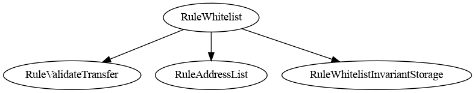
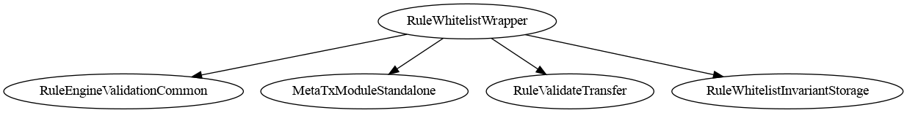
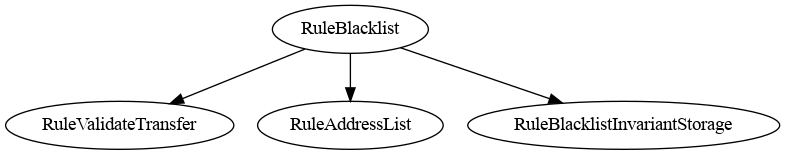

# RuleEngine - Rules

**Rules** is a collection of on-chain compliance and transfer-restriction rules designed for use with the [CMTA RuleEngine](https://github.com/CMTA/RuleEngine) and the [CMTAT token standard](https://github.com/CMTA/CMTAT).

Each rule can be used **standalone**, directly plugged into a CMTAT token, **or** managed collectively via a RuleEngine.

> This project has not undergone an audit and is provided as-is without any warranties.

## Schema

- Using rules with CMTAT and ERC-3643 tokens through a [RuleEngine](ttps://github.com/CMTA/RuleEngine)


- Using a rule directly with CMTAT and ERC-3643 tokens


## Table of Contents

[TOC]


## Overview

The **RuleEngine** is an external smart contract that applies transfer restrictions to security tokens such as **CMTAT** or [ERC-3643](https://eips.ethereum.org/EIPS/eip-3643)-compatible tokens through a RuleEngine.
Rules are modular validator contracts that the `RuleEngine` or `CMTAT` compatible token can call on every transfer to ensure regulatory and business-logic compliance.

### Key Concepts

- **Rules are controllers** that validate or modify token transfers.
- They can be applied:
  - Directly on **CMTAT** (no RuleEngine required), **or**
  - Through the [**RuleEngine**](https://github.com/CMTA/RuleEngine) (for multi-rule orchestration).
- Rules enforce conditions such as:
  - Whitelisting / blacklisting
  - Sanctions checks
  - Multi-party operator-managed lists
  - Conditional approvals
  - Arbitrary compliance logic

## Quick Start

```bash
# 1. Clone the repository
git clone <repo-url>
cd Rules

# 2. Install Foundry (if not already installed)
# https://book.getfoundry.sh/getting-started/installation

# 3. Install submodule dependencies
forge install

# 4. Compile
forge build

# 5. Run tests
forge test
```

## Compatibility

| Component        | Compatible Versions                       |
| ---------------- | ----------------------------------------- |
| **Rules v0.1.0** | CMTAT ≥ v3.0.0<br />RuleEngine v3.0.0-rc1 |

Each Rule implements the interface `IRuleEngine` defined in CMTAT.

This interface declares the ERC-3643 functions `transferred`(read-write) and `canTransfer`(read-only) with several other functions related to [ERC-1404](https://github.com/ethereum/eips/issues/1404), [ERC-7551](https://ethereum-magicians.org/t/erc-7551-crypto-security-token-smart-contract-interface-ewpg-reworked/25477) and [ERC-3643](https://eips.ethereum.org/EIPS/eip-3643).

## Specifications

Draft ERC specifications maintained in this repository:

- `ERCSpecification/erc-XXXX-transfer-context.md` - transfer context hook (fungible and non-fungible).

### ERC-3643

Each rule implements the following functions from the ERC-3643 `ICompliance`interface

```solidity
function canTransfer(address _from, address _to, uint256 _amount) external view returns (bool);
function transferred(address _from, address _to, uint256 _amount) external;
```

However, contrary to the RuleEngine, the whole interface is currently not implemented (e.g. `created`and `destroyed`) and as a result, the rule can not directly supported ERC-3643 token.

The alternative to use a Rule with an ERC-3643 token is trough the RuleEngine, which implements the whole `ICompliance` interface.

### ERC-721/ERC-1155

To improve compatibility with [ERC-721](https://eips.ethereum.org/EIPS/eip-721) and [ERC-1155](https://eips.ethereum.org/EIPS/eip-1155), most validation rules implement the interface `IERC7943NonFungibleComplianceExtend` which includes compliance functions with the `tokenId` argument. Operation rules (such as `RuleConditionalTransferLight`) are ERC-20 only and do not expose the ERC-721/1155 interfaces. `RuleMaxTotalSupply` is ERC-20 only as well and does not expose ERC-721/1155 interfaces.

While no rules currently apply restriction on the token id, the validation interfaces can be used to implement flexible restriction on ERC-721 or ERC-1155 tokens.

```solidity
// IERC7943NonFungibleCompliance interface
// Read-only functions
function canTransfer(address from, address to, uint256 tokenId, uint256 amount)external view returns (bool allowed)

// IERC7943NonFungibleComplianceExtend interface
// Read-only functions
function detectTransferRestriction(address from, address to, uint256 tokenId, uint256 amount)external view returns (uint8 code);
function detectTransferRestrictionFrom(address spender, address from, address to, uint256 tokenId, uint256 value)external view returns (uint8 code);
function canTransferFrom(address spender, address from, address to, uint256 tokenId, uint256 value)external returns (bool allowed);

// State modifying functions (write)
function transferred(address from, address to, uint256 tokenId, uint256 value) external;
function transferred(address spender, address from, address to, uint256 tokenId, uint256 value) external;
```


## Architecture

### Naming Conventions

- `*Base` contracts contain core logic without an access-control policy.
- `*InvariantStorage` contracts group constants, custom errors, and events.
- `*Common` contracts provide shared helper logic across variants (legacy naming retained for compatibility).

### Directory Layout

- `src/modules/`: reusable modules shared across rules (`AccessControlModuleStandalone`, `MetaTxModuleStandalone`, `VersionModule`).
- `src/rules/interfaces/`: shared interfaces (`IAddressList`, `IIdentityRegistry`, `ISanctionsList`, `ITransferContext`).
- `src/rules/validation/abstract/`: shared base contracts and invariant storage.
- `src/rules/validation/abstract/base/`: base contracts with core rule logic (no access control).
- `src/rules/validation/abstract/core/`: shared adapters/validation helpers.
- `src/rules/validation/abstract/invariant/`: invariant storage contracts (constants, errors, events).
- `src/rules/validation/deployment/`: deployable validation rules (concrete contracts).
- `src/rules/operation/`: read-write (operation) rules that modify state on transfer.
- `test/`: Foundry tests, one folder per rule.
- `script/`: deployment scripts.

### Rule - Code list

> It is very important that each rule uses an unique code

Here the list of codes used by the different rules

| Contract                | Constant name                        | Value |
| ----------------------- | ------------------------------------ | ----- |
| All                     | TRANSFER_OK (from CMTAT)             | 0     |
| RuleWhitelist           | CODE_ADDRESS_FROM_NOT_WHITELISTED    | 21    |
|                         | CODE_ADDRESS_TO_NOT_WHITELISTED      | 22    |
|                         | CODE_ADDRESS_SPENDER_NOT_WHITELISTED | 23    |
|                         | Reserved slot                        | 24-29 |
| RuleSanctionList        | CODE_ADDRESS_FROM_IS_SANCTIONED      | 30    |
|                         | CODE_ADDRESS_TO_IS_SANCTIONED        | 31    |
|                         | CODE_ADDRESS_SPENDER_IS_SANCTIONED   | 32    |
|                         | Reserved slot                        | 33-35 |
| RuleBlacklist           | CODE_ADDRESS_FROM_IS_BLACKLISTED     | 36    |
|                         | CODE_ADDRESS_TO_IS_BLACKLISTED       | 37    |
|                         | CODE_ADDRESS_SPENDER_IS_BLACKLISTED  | 38    |
|                         | Reserved slot                        | 39-45 |
| RuleConditionalTransferLight | CODE_TRANSFER_REQUEST_NOT_APPROVED   | 46   |
|                         | Reserved slot                        | 47-49 |
| RuleMaxTotalSupply      | CODE_MAX_TOTAL_SUPPLY_EXCEEDED       | 50   |
|                         | Reserved slot                        | 51-54 |
| RuleIdentityRegistry    | CODE_ADDRESS_FROM_NOT_VERIFIED       | 55   |
|                         | CODE_ADDRESS_TO_NOT_VERIFIED         | 56   |
|                         | CODE_ADDRESS_SPENDER_NOT_VERIFIED    | 57   |
|                         | Reserved slot                        | 58-59 |
| RuleERC2980             | CODE_ADDRESS_FROM_IS_FROZEN          | 60   |
|                         | CODE_ADDRESS_TO_IS_FROZEN            | 61   |
|                         | CODE_ADDRESS_SPENDER_IS_FROZEN       | 62   |
|                         | CODE_ADDRESS_TO_NOT_WHITELISTED      | 63   |
|                         | Reserved slot                        | 64-65 |
| RuleSpenderWhitelist    | CODE_ADDRESS_SPENDER_NOT_WHITELISTED | 66   |
|                         | Reserved slot                        | 67-70 |

Note: 

- The CMTAT already uses the code 0-6 and the code 7-12 should be left free to allow further additions in the CMTAT.
- If you decide to create your own rules, we encourage you to use code > 100 to leave free the other restriction codes for future rules added in this project.
- Reserved slots are intentionally left unused for future rule expansion (maximum of 3 per rule).
- New rule code blocks should start at codes ending in `1` or `6` (e.g., `21`, `26`), leaving the remaining codes in the previous block for that prior rule’s reserved slots.
- Current allocations are legacy; new rules should follow the start-at-1-or-6 policy without changing existing codes.

### Rules as Standalone Compliance Contracts

Every rule implements the minimal interface expected by **CMTAT**, notably:

```solidity
function transferred(address from, address to, uint256 value)
function transferred(address spender, address from, address to, uint256 value)
```

This makes rules directly pluggable into CMTAT without any intermediary RuleEngine.

### Transfer Context Helper

Rules also expose an optional unified entrypoint using `MultiTokenTransferContext` / `FungibleTransferContext` (see `ITransferContext`) to pass a single struct instead of multiple arguments. This is a helper API inspired by [TokenF](https://github.com/dl-tokenf/contracts) and does not replace the standard ERC-3643 / RuleEngine interfaces. Validation rules generally expose both the non-fungible and fungible variants; `RuleConditionalTransferLight` and `RuleMaxTotalSupply` expose only the fungible variant.

Two struct variants are available:

```solidity
// For ERC-721 / ERC-1155 (includes tokenId)
struct MultiTokenTransferContext {
    bytes4 selector;   // function selector of the original call
    address sender;    // operator/spender (address(0) for direct transfers)
    address from;      // token sender
    address to;        // token recipient
    uint256 value;     // amount transferred
    uint256 tokenId;   // token id (non-fungible)
    bytes data; // Optional token-provided metadata for rules
}

// For ERC-20 (no tokenId)
struct FungibleTransferContext {
    bytes4 selector;   // function selector of the original call
    address sender;    // operator/spender (address(0) for direct transfers)
    address from;      // token sender
    address to;        // token recipient
    uint256 value;     // amount transferred
    bytes data; // Optional token-provided metadata for rules
}
```

Both structs are passed to `transferred(MultiTokenTransferContext calldata ctx)` or `transferred(FungibleTransferContext calldata ctx)`. If `ctx.sender` is non-zero, the spender-aware path is used internally; otherwise the standard two-party path is used. The `data` field is reserved for optional token-provided metadata that rules can interpret.

### Using Rules via RuleEngine

When used through the RuleEngine, a rule must also implement:

```solidity
interface IRule is IRuleEngine {
    function canReturnTransferRestrictionCode(uint8 restrictionCode)
        external
        view
        returns (bool);
}
```

The RuleEngine can then:

- Aggregate multiple rules
- Execute them sequentially on each transfer
- Return restriction codes
- Mutate rule state (operation rules)

#### CMTAT

Each rule can be directly plugged to a CMTAT token similar to a RuleEngine.

Indeed, each rules implements the required interface (`IRuleEngine`) with notably the following function as entrypoint.

```solidity
function transferred(address from,address to,uint256 value)
function transferred(address spender,address from,address to,uint256 value)
```

```solidity
/*
* @title Minimum interface to define a RuleEngine
*/
interface IRuleEngine is IERC1404Extend, IERC7551Compliance,  IERC3643IComplianceContract {
    /**
     *  @notice
     *  Function called whenever tokens are transferred from one wallet to another
     *  @dev 
     *  Must revert if the transfer is invalid
     *  Same name as ERC-3643 but with one supplementary argument `spender`
     *  This function can be used to update state variables of the RuleEngine contract
     *  This function can be called ONLY by the token contract bound to the RuleEngine
     *  @param spender spender address (sender)
     *  @param from token holder address
     *  @param to receiver address
     *  @param value value of tokens involved in the transfer
     */
    function transferred(address spender, address from, address to, uint256 value) external;
}
```


#### RuleEngine

For a RuleEngine, each rule implements also the required entry point similar to CMTAT, and as well some specific interface for the RuleEngine through the implementation of `IRule`interface dfeined in the RuleEngine repository

```solidity
interface IRule is IRuleEngine {
    /**
     * @dev Returns true if the restriction code exists, and false otherwise.
     */
    function canReturnTransferRestrictionCode(
        uint8 restrictionCode
    ) external view returns (bool);
}

```


## Types of Rules

There are two categories of rules: validation rules (read-only) and operation rules (read-write).

### Validation Rules (Read-Only)

Validation rules only read blockchain state — they never modify it during a transfer. They implement `transferred()` as a `view` function: it re-runs the same restriction check and reverts if the transfer would be blocked, but writes nothing to storage.

All validation rules implement `IRuleEngine` to be usable both standalone (plugged directly into CMTAT) and via the RuleEngine.

Available validation rules: `RuleWhitelist`, `RuleWhitelistWrapper`, `RuleSpenderWhitelist`, `RuleBlacklist`, `RuleSanctionsList`, `RuleMaxTotalSupply`, `RuleIdentityRegistry`, `RuleERC2980`.

 A community made project, [RuleSelf](https://github.com/rya-sge/ruleself), which uses [Self](https://self.xyz), a zero-knowledge identity is also available but is not developed or maintained by CMTA.

### Operation Rules (Read-Write)

Operation rules modify blockchain state during transfer execution. Their `transferred()` function is state-mutating: it consumes or updates stored data as part of the transfer flow.

Available operation rules: `RuleConditionalTransferLight`. 

A full-featured variant, `RuleConditionalTransfer`, is maintained as a separate experimental repository at [CMTA/RuleConditionalTransfer](https://github.com/CMTA/RuleConditionalTransfer).

## Deployment Guide

1. Deploy the rule contract(s) with the desired admin and optional module addresses.
2. Configure the rule state and roles, including whitelist/blacklist entries and oracle or registry addresses.
3. Add rules to the RuleEngine, or set the rule directly on the CMTAT token.
4. Verify the transfer flow end-to-end with a small test transfer before enabling production flows.

Deployment scripts:
- `script/DeployCMTATWithWhitelist.s.sol`
- `script/DeployCMTATWithBlacklist.s.sol`
- `script/DeployCMTATWithBlacklistAndSanctionsList.s.sol` — CMTAT + RuleEngine with blacklist and sanctions rules

### Choosing a Rule Variant

Several rules are available in multiple access-control variants. Use the simplest one that fits your needs:

- `AccessControl` variants: use when you need multi-operator roles or delegated administration.
- `Ownable2Step` variants: use when you want a safer two-step ownership transfer.

### Validation Rules (Read-Only)

- Cannot modify blockchain state during transfers.
- Used for simple eligibility checks.
- Examples:
  - Whitelist
  - Whitelist Wrapper
  - Spender Whitelist
  - Blacklist
  - Sanction list (Chainalysis)
  - ERC-2980 (whitelist + frozenlist)

### Operation Rules (Read-Write)

- Can update state during transfer calls.
- Example:
  - Conditional Transfer (approval-based)

## Rules details

### Summary tab

| Rule                                                         | Type <br />[read-only / read-write] | ERC-721 / ERC-1155 | ERC-3643 | Security Audit planned in the roadmap | Description                                                  |
| ------------------------------------------------------------ | ------------------------------------ | ------------------ | -------- | ------------------------------------- | ------------------------------------------------------------ |
| RuleWhitelist                                                | Read-only                          | <strong><span style="color: #1e7e34;">&#x2714;</span></strong> | <strong><span style="color: #1e7e34;">&#x2714;</span></strong> | <strong><span style="color: #1e7e34;">&#x2714;</span></strong> | This rule can be used to restrict transfers from/to only addresses inside a whitelist. |
| RuleWhitelistWrapper                                         | Read-Only                           | <strong><span style="color: #1e7e34;">&#x2714;</span></strong> | <strong><span style="color: #1e7e34;">&#x2714;</span></strong> | <strong><span style="color: #1e7e34;">&#x2714;</span></strong> | This rule can be used to restrict transfers from/to only addresses inside a group of whitelist rules managed by different operators. |
| RuleBlacklist                                                | Read-Only                           | <strong><span style="color: #1e7e34;">&#x2714;</span></strong> | <strong><span style="color: #1e7e34;">&#x2714;</span></strong> | <strong><span style="color: #1e7e34;">&#x2714;</span></strong> | This rule can be used to forbid transfer from/to addresses in the blacklist |
| RuleSanctionList                                             | Read-Only                           | <strong><span style="color: #1e7e34;">&#x2714;</span></strong> | <strong><span style="color: #1e7e34;">&#x2714;</span></strong> | <strong><span style="color: #1e7e34;">&#x2714;</span></strong> | The purpose of this contract is to use the oracle contract from [Chainalysis](https://go.chainalysis.com/chainalysis-oracle-docs.html) to forbid transfer from/to an address included in a sanctions designation (US, EU, or UN). |
| RuleMaxTotalSupply                                           | Read-Only                          | <strong><span style="color: #b00020;">&#x2718;</span></strong> | <strong><span style="color: #1e7e34;">&#x2714;</span></strong> | <strong><span style="color: #1e7e34;">&#x2714;</span></strong> | This rule limits minting so that the total supply never exceeds a configured maximum. |
| RuleIdentityRegistry                                         | Read-Only                          | <strong><span style="color: #1e7e34;">&#x2714;</span></strong> | <strong><span style="color: #1e7e34;">&#x2714;</span></strong> | <strong><span style="color: #1e7e34;">&#x2714;</span></strong> | This rule checks the ERC-3643 Identity Registry for transfer participants when configured. |
| RuleSpenderWhitelist                                         | Read-Only                          | <strong><span style="color: #1e7e34;">&#x2714;</span></strong> | <strong><span style="color: #1e7e34;">&#x2714;</span></strong> | <strong><span style="color: #1e7e34;">&#x2714;</span></strong> | This rule blocks `transferFrom` when the spender is not in the whitelist. Direct transfers are always allowed. |
| RuleERC2980                                                  | Read-Only                          | <strong><span style="color: #1e7e34;">&#x2714;</span></strong> | <strong><span style="color: #1e7e34;">&#x2714;</span></strong> | <strong><span style="color: #1e7e34;">&#x2714;</span></strong> | ERC-2980 Swiss Compliant rule combining a whitelist (recipient-only) and a frozenlist (blocks sender, recipient, and spender for `transferFrom`). Frozenlist takes priority over whitelist. |
| RuleConditionalTransferLight                                | Read-Write                          | <strong><span style="color: #b00020;">&#x2718;</span></strong> | <strong><span style="color: #1e7e34;">&#x2714;</span></strong> | <strong><span style="color: #1e7e34;">&#x2714;</span></strong> | This rule requires that transfers have to be approved by an operator before being executed. Each approval is consumed once and the same transfer can be approved multiple times. |
| [RuleConditionalTransfer](https://github.com/CMTA/RuleConditionalTransfer) (external) | Read-Write | <strong><span style="color: #b00020;">&#x2718;</span></strong> | <strong><span style="color: #1e7e34;">&#x2714;</span></strong> | <strong><span style="color: #b00020;">&#x2718;</span></strong><br /> (experimental rule) | Full-featured approval-based transfer rule implementing Swiss law *Vinkulierung*. Supports automatic approval after three months, automatic transfer execution, and a conditional whitelist for address pairs that bypass approval. Maintained in a separate repository. |
| [RuleSelf](https://github.com/rya-sge/ruleself) (community) | — | <strong><span style="color: #b00020;">&#x2718;</span></strong> | — | <strong><span style="color: #b00020;">&#x2718;</span></strong><br /> (community project) | Use [Self](https://self.xyz), a zero-knowledge identity  solution to determine which is allowed to interact with the token.<br />Community-maintained rule project. Not developed or maintained by CMTA. |

All rules are compatible with CMTAT, as noted earlier in this README.

### Technical documentation

Detailed technical documentation for each rule is available in [`doc/technical/`](doc/technical/):

| Rule | Document |
| ---- | -------- |
| RuleWhitelist | [RuleWhitelist.md](./doc/technical/RuleWhitelist.md) |
| RuleWhitelistWrapper | [RuleWhitelistWrapper.md](./doc/technical/RuleWhitelistWrapper.md) |
| RuleBlacklist | [RuleBlacklist.md](./doc/technical/RuleBlacklist.md) |
| RuleSanctionsList | [RuleSanctionList.md](./doc/technical/RuleSanctionList.md) |
| RuleMaxTotalSupply | [RuleMaxTotalSupply.md](./doc/technical/RuleMaxTotalSupply.md) |
| RuleIdentityRegistry | [RuleIdentityRegistry.md](./doc/technical/RuleIdentityRegistry.md) |
| RuleSpenderWhitelist | [RuleSpenderWhitelist.md](./doc/technical/RuleSpenderWhitelist.md) |
| RuleERC2980 | [RuleERC2980.md](./doc/technical/RuleERC2980.md) |
| RuleConditionalTransferLight | [RuleConditionalTransferLight.md](./doc/technical/RuleConditionalTransferLight.md) |

### Operational Notes

- `RuleIdentityRegistry` allows burns (`to == address(0)`) even if the sender is not verified. This matters only if the token allows self-burn.
- `RuleSanctionsList` rejects zero address in `setSanctionListOracle`. Use `clearSanctionListOracle()` to disable checks.
- `RuleIdentityRegistry` can be disabled with `clearIdentityRegistry()`, which allows all transfers to pass this rule.
- Constructors for `RuleSanctionsList` and `RuleIdentityRegistry` accept a zero address to start in a disabled state.
- `RuleMaxTotalSupply` trusts the configured `tokenContract` to return an accurate `totalSupply()`.
- `RuleMaxTotalSupply` does not allow clearing the token contract; disable the rule by removing it from the RuleEngine or token.
- `RuleWhitelistWrapper` requires child rules that implement `IAddressList`. Gas cost grows with the number of rules, and a wrapper with zero rules will reject all transfers.
- `RuleSpenderWhitelist` only checks the spender in `transferFrom`; direct transfers always pass this rule.
- Read-only rules still implement `transferred()` to comply with ERC-3643 and RuleEngine interfaces, but they do not change state.
- `RuleConditionalTransferLight` approvals are keyed by `(from, to, value)` and are not nonce-based.
- `RuleConditionalTransferLight` provides `approveAndTransferIfAllowed` to approve and immediately execute `transferFrom` when this rule has allowance; it assumes the token calls back `transferred()` during the transfer.
- `RuleConditionalTransferLight` restricts `transferred()` to the single token bound via `bindToken`. Only one token can be bound at a time: a second `bindToken` call reverts with `RuleConditionalTransferLight_TokenAlreadyBound`. The token can be unbound with `unbindToken`, after which a new token may be bound.
- `RuleConditionalTransferLight` exempts mints (`from == address(0)`) and burns (`to == address(0)`) from the approval requirement; `created` and `destroyed` delegate to `_transferred`, which returns early for those cases.
- AccessControl variants use `onlyRole(ROLE)` in `_authorize*()` and internal helpers are marked `virtual`.
- AccessControl variants use `AccessControlEnumerable`, so role members can be enumerated with `getRoleMember` / `getRoleMemberCount`. The default admin is treated as having all roles via `hasRole`, but may not appear in role member lists unless explicitly granted.
- `forwarderIrrevocable` is accepted as-is (including `address(0)`), and is not validated against ERC-165 because some forwarders do not implement it.
- `RuleERC2980` frozenlist takes priority over the whitelist: an address that is both whitelisted and frozen will be rejected. A frozen address acting as a `transferFrom` spender is also blocked (code 62), even if `from` and `to` are not frozen.
- `RuleERC2980` sender (`from`) does not need to be whitelisted; only the recipient (`to`) must be whitelisted for a transfer to succeed.
- All rules implement `IERC3643Version` via `VersionModule` and expose a `version()` function returning `"0.2.0"`.

### Read-only (validation) rule

Currently, there are eight validation rules: whitelist, whitelistWrapper, spender whitelist, blacklist, sanctionlist, max total supply, identity registry, and ERC-2980.

#### Whitelist

Only whitelisted addresses may hold or receive tokens.
 Transfers are rejected if:

- `from` is not whitelisted
- `to` is not whitelisted

The rule is read-only: it only checks stored state.

**Example**

During a transfer, this rule, called by the RuleEngine, will check if the address concerned is in the list, applying a read operation on the blockchain.

**Usage scenario**

An operator configures CMTAT to use `RuleWhitelist`. The issuer tries to mint to Alice via `mint`/`transfer` and the token calls `detectTransferRestriction`/`transferred`; Alice is not listed so the call reverts. The operator calls `addAddress(Alice)`. The issuer retries the mint and it succeeds.



#### Spender whitelist

This rule only checks `transferFrom` spender authorization:

- Direct transfers (`transfer`) are always allowed by this rule.
- `transferFrom` is rejected when `spender` is not listed.
- Restriction code: `66` (`CODE_ADDRESS_SPENDER_NOT_WHITELISTED`).

**Usage scenario**

The operator deploys `RuleSpenderWhitelist` and sets it in the token or `RuleEngine`. Alice calls `transfer` to Bob and it passes this rule. Bob then tries `transferFrom(Alice, Bob, amount)` and it is rejected until the operator calls `addAddress(Bob)` (or whichever spender account should be authorized).


#### Whitelist wrapper

Allows independent whitelist groups managed by different operators.

- Each operator manages a dedicated whitelist.
- A transfer is allowed only if both addresses belong to *at least one* operator-managed list.
- Enables multi-party compliance

**Usage scenario**

Two operators maintain separate whitelists using `addRule`/`setRules` and each child rule’s `addAddress`. A transfer between Alice and Bob is allowed if at least one child whitelist returns `true` for both via `areAddressesListed`; otherwise `detectTransferRestriction` rejects it.


##### Architecture

This rule inherits from `RuleEngineValidationCommon`. Thus the whitelist rules are managed with the same architecture and code than for the ruleEngine. For example, rules are added with the functions `setRules` or `addRule`.





#### Blacklist

Opposite of whitelist:

- Transfer fails if **either** address is blacklisted.

**Usage scenario**

The operator sets `RuleBlacklist` on the token. The issuer tries to transfer to Bob; `detectTransferRestriction` passes. The operator calls `addAddress(Bob)`. A subsequent transfer to Bob is rejected until `removeAddress(Bob)` is called.



#### ERC-2980 (Whitelist + Frozenlist)

Implements the [ERC-2980](https://eips.ethereum.org/EIPS/eip-2980) Swiss Compliant Asset Token transfer restriction using two independent address lists managed in a single rule:

- **Whitelist**: only whitelisted addresses may *receive* tokens. Senders do not need to be whitelisted and may freely transfer tokens they already hold.
- **Frozenlist**: frozen addresses are completely blocked — they can neither send nor receive tokens. Additionally, a frozen address acting as a `transferFrom` spender will have the transfer rejected (code 62), even if `from` and `to` are not frozen.
- **Priority**: frozenlist is checked first. If `from`, `to`, or `spender` is frozen, the transfer is rejected regardless of whitelist membership.


Restriction codes:

| Constant | Code | Meaning |
| --- | --- | --- |
| `CODE_ADDRESS_FROM_IS_FROZEN` | 60 | Sender is frozen |
| `CODE_ADDRESS_TO_IS_FROZEN` | 61 | Recipient is frozen |
| `CODE_ADDRESS_SPENDER_IS_FROZEN` | 62 | Spender is frozen |
| `CODE_ADDRESS_TO_NOT_WHITELISTED` | 63 | Recipient is not whitelisted |

**Deviation from spec**: the ERC-2980 `Whitelistable` / `Freezable` example interfaces define single-address management functions that return `bool` and do not revert on duplicates or missing entries. This implementation reverts on invalid single-item operations, consistent with the codebase convention. Batch operations remain non-reverting.

**Usage scenario**

The operator deploys `RuleERC2980`. The issuer whitelists Alice with `addWhitelistAddress(Alice)`. A transfer to Alice succeeds. The compliance officer freezes Bob with `addFrozenlistAddress(Bob)`. Any transfer from or to Bob is now rejected even if Bob was previously whitelisted.

#### Sanction list with Chainalysis

Uses the [Chainalysis](https://www.chainalysis.com/) Oracle to reject transfers involving sanctioned addresses.

- Checks lists for: **US**, **EU**, and **UN** sanctions.
- Documentation: *Chainalysis Oracle for sanctions screening*
- If `from` or `to` is sanctioned, transfer is rejected.

Documentation and the contracts addresses are available here: [Chainalysis oracle for sanctions screening](https://go.chainalysis.com/chainalysis-oracle-docs.html).


**Example**

During a transfer, if either address (from or to) is in the sanction list of the Oracle, the rule will return false, and the transfer will be rejected by the CMTAT.

**Usage scenario**

The operator sets the Chainalysis oracle with `setSanctionListOracle`. The token’s transfer path calls `detectTransferRestriction`; if the oracle flags `from` or `to`, the transfer is rejected. Calling `clearSanctionListOracle` disables checks.

#### Max total supply

Limits minting so that total supply never exceeds a configured maximum. Transfers and burns are not affected; only mints (`from == address(0)`) are checked.


**Usage scenario**

The operator deploys `RuleMaxTotalSupply` with `setMaxTotalSupply(1_000_000)` and sets the token with `setTokenContract`. When the issuer mints and `totalSupply + amount` exceeds the limit, `detectTransferRestriction` rejects the mint. Transfers between holders still pass.

#### Identity registry

If an identity registry address is set, this rule checks `isVerified` for the sender, recipient, and spender (for `transferFrom`). Zero addresses are ignored, and burns (`to == address(0)`) are always allowed so non‑verified holders can burn.


**Usage scenario**

The operator calls `setIdentityRegistry(registry)`. The issuer attempts a transfer to Alice; `detectTransferRestriction` consults `isVerified` and rejects if Alice is unverified. After the registry marks Alice verified, the transfer succeeds. Calling `clearIdentityRegistry` disables checks.

### Read-Write (Operation) rule

For the moment, there is only one operation rule available: ConditionalTransferLight.

#### Conditional transfer (light)

This rule requires that transfers must be approved by an operator before being executed. It hashes `(from, to, value)` to track approvals and allows the same transfer to be approved multiple times. Each successful transfer consumes one approval, applying a write operation on the blockchain. Mints (`from == address(0)`) and burns (`to == address(0)`) are exempt and always pass without requiring approval.


**Usage scenario**

An operator calls `approveTransfer(from, to, value)`. The compliance manager binds exactly one token with `bindToken(token)`; attempting to bind a second token reverts. The token calls `detectTransferRestriction` (passes) and later `transferred` to consume the approval. Without approval, `detectTransferRestriction` returns code 46 and the transfer is rejected. The operator can revoke with `cancelTransferApproval`. To migrate to a different token, the compliance manager must first call `unbindToken` before binding the new one.

## Access Control

The module `AccessControlModuleStandalone` implements RBAC access control by inheriting from OpenZeppelin's `AccessControlEnumerable`.

Each rule implements its own access control by inheriting from `AccessControlModuleStandalone`. The default admin is the address passed as `admin` to the constructor at deployment.

#### `DEFAULT_ADMIN_ROLE` implicit role behaviour

`AccessControlModuleStandalone` overrides OpenZeppelin's `hasRole` so that any account holding `DEFAULT_ADMIN_ROLE` returns `true` for **every** role check. This is intentional: the OpenZeppelin `DEFAULT_ADMIN_ROLE` holder can already grant itself any role at any time, so treating it as implicitly holding all roles from the start removes unnecessary ceremony and makes access management easier in practice.

Practical consequences integrators must be aware of:

- **`grantRole` to a default admin is a no-op.** `_grantRole` checks `!hasRole(role, account)` before writing storage; since the admin already returns `true` via the override, the storage write and the `RoleGranted` event are skipped. The admin will **not** appear in `getRoleMember` / `getRoleMemberCount` enumerations for non-default roles unless the role was explicitly granted before the admin was set.
- **`revokeRole` / `renounceRole` on a non-default role for a default admin are misleading.** They emit `RoleRevoked` and clear the storage flag, but `hasRole` continues to return `true` because the account still holds `DEFAULT_ADMIN_ROLE`. The effective privilege is unchanged. To fully remove access, `DEFAULT_ADMIN_ROLE` itself must be revoked.
- **Off-chain monitoring should use `hasRole` queries**, not role-membership events or enumeration, to determine the effective privileges of admin accounts.

See also [docs.openzeppelin.com - AccessControl](https://docs.openzeppelin.com/contracts/5.x/api/access#AccessControl)

### Role Summary

| Role | Hash | Functions (by rule) |
| --- | --- | --- |
| `DEFAULT_ADMIN_ROLE` | `0x0000000000000000000000000000000000000000000000000000000000000000` | `grantRole`, `revokeRole`, `renounceRole` (all AccessControl rules); `setCheckSpender` (RuleWhitelist, RuleWhitelistWrapper); `setMaxTotalSupply`, `setTokenContract` (RuleMaxTotalSupply); `setIdentityRegistry`, `clearIdentityRegistry` (RuleIdentityRegistry) |
| `ADDRESS_LIST_ADD_ROLE` | `0x1b03c849816e077359373cf0a8d6d8f741d643bc1e95273ffe11515f83bebf61` | `addAddress`, `addAddresses` (RuleWhitelist, RuleBlacklist) |
| `ADDRESS_LIST_REMOVE_ROLE` | `0x1b94c92b564251ed6b49246d9a82eb7a486b6490f3b3a3bf3b28d2e99801f3ec` | `removeAddress`, `removeAddresses` (RuleWhitelist, RuleBlacklist) |
| `SANCTIONLIST_ROLE` | `0x30842281ac34bdc7d568c7ab276f84ba6fc1a1de1ae858b0afd35e716fb0650d` | `setSanctionListOracle`, `clearSanctionListOracle` (RuleSanctionsList) |
| `RULES_MANAGEMENT_ROLE` | `0xea5f4eb72290e50c32abd6c23e45de3d8300b3286e1cbc2e293114b92e034e5e` | `setRules`, `clearRules`, `addRule`, `removeRule` (RuleWhitelistWrapper) |
| `OPERATOR_ROLE` | `0x97667070c54ef182b0f5858b034beac1b6f3089aa2d3188bb1e8929f4fa9b929` | `approveTransfer`, `cancelTransferApproval` (RuleConditionalTransferLight) |
| `COMPLIANCE_MANAGER_ROLE` | `0xe5c50d0927e06141e032cb9a67e1d7092dc85c0b0825191f7e1cede600028568` | `bindToken`, `unbindToken` (RuleConditionalTransferLight) |
| `WHITELIST_ADD_ROLE` | `0x77c0b4c0975a0b0417d8ce295502737b95fee8923755fed0cce952907a1861ed` | `addWhitelistAddress`, `addWhitelistAddresses` (RuleERC2980) |
| `WHITELIST_REMOVE_ROLE` | `0xf4d11a530c5b90f459c6ab1e335d3d77156b8ff3093308e4fca6d100ee87ade9` | `removeWhitelistAddress`, `removeWhitelistAddresses` (RuleERC2980) |
| `FROZENLIST_ADD_ROLE` | `0xc52c49807a071974b9260f4b553ee09bd9fd85f687d8d4cc3232de7104ff7835` | `addFrozenlistAddress`, `addFrozenlistAddresses` (RuleERC2980) |
| `FROZENLIST_REMOVE_ROLE` | `0x8be92b33a413d98540bfb0edc9129253db6d924f6c2e32c4b7809d237f7b2aaa` | `removeFrozenlistAddress`, `removeFrozenlistAddresses` (RuleERC2980) |

### Ownable2Step variants

For simpler ownership-based control, `Ownable2Step` variants (two-step ownership transfer) are available:

- `RuleWhitelistOwnable2Step`
- `RuleBlacklistOwnable2Step`
- `RuleWhitelistWrapperOwnable2Step`
- `RuleSanctionsListOwnable2Step`
- `RuleIdentityRegistryOwnable2Step`
- `RuleMaxTotalSupplyOwnable2Step`
- `RuleERC2980Ownable2Step`
- `RuleConditionalTransferLightOwnable2Step`

`RuleConditionalTransferLightOwnable2Step` now grants approval and execution permissions exclusively to the owner.
All `Ownable2Step` variants enforce access using OpenZeppelin's `onlyOwner` modifier.

### Address List

Common access control between `blacklistRule`and `WhitelistRule`

These roles are listed above in the Role Summary table.


## Toolchains and Usage

### Configuration

Here are the settings for [Hardhat](https://hardhat.org) and [Foundry](https://getfoundry.sh).

- `hardhat.config.js`

  - Solidity [v0.8.34](https://docs.soliditylang.org/en/v0.8.34/)
  - EVM version: Prague (Pectra upgrade)
  - Optimizer: true, 200 runs

- `foundry.toml`

  - Solidity [v0.8.34](https://docs.soliditylang.org/en/v0.8.34/)
  - EVM version: Prague (Pectra upgrade)
  - Optimizer: true, 200 runs

- Library

  - Foundry [v1.5.0](https://github.com/foundry-rs/foundry)

  - Forge std [v1.12.0](https://github.com/foundry-rs/forge-std/releases/tag/v1.12.0  )  

  - OpenZeppelin Contracts (submodule) [v5.6.0](https://github.com/OpenZeppelin/openzeppelin-contracts/releases/tag/v5.6.0)

  - CMTAT [v3.2.0](https://github.com/CMTA/CMTAT/releases/tag/v3.2.0)

  - RuleEngine [v3.0.0-rc1](https://github.com/CMTA/RuleEngine/releases/tag/v3.0.0-rc1)

### Toolchain installation

The contracts are developed and tested with [Foundry](https://book.getfoundry.sh), a smart contract development toolchain.

To install the Foundry suite, please refer to the official instructions in the [Foundry book](https://book.getfoundry.sh/getting-started/installation).

### Initialization

You must first initialize the submodules, with

```
forge install
```

See also the command's [documentation](https://book.getfoundry.sh/reference/forge/forge-install).

Later you can update all the submodules with:

```
forge update
```

See also the command's [documentation](https://book.getfoundry.sh/reference/forge/forge-update).

### Compilation

The official documentation is available in the Foundry [website](https://book.getfoundry.sh/reference/forge/build-commands) 

```
 forge build
```

### Contract size

```bash
 forge compile --sizes
```

### Testing

You can run the tests with

```bash
forge test
```

To run a specific test, use

```bash
forge test --match-contract <contract name> --match-test <function name>
```

- For `RuleConditionalTransferLight` fuzz/integration tests, note that mint and burn paths (`from == address(0)` or `to == address(0)`) are intentionally exempt from approval consumption.
- Ownable2Step variants also include dedicated tests for ownership transfer and manager-only functions (IdentityRegistry, MaxTotalSupply, SanctionsList).
- Coverage-focused tests also target deployment wrappers and operation-rule overloads (`created`, `destroyed`, spender-aware `transferred`) to improve line/function coverage in `src/rules/operation` and `src/rules/validation/deployment`.

Generate gas report

```bash
forge test --gas-report
```

See also the test framework's [official documentation](https://book.getfoundry.sh/forge/tests), and that of the [test commands](https://book.getfoundry.sh/reference/forge/test-commands).

### Gas Benchmarks

Gas usage is tracked in two complementary files:

- **`.gas-snapshot`** — machine-generated file produced by `forge snapshot`. It records the gas cost of every test function and is checked into the repository so that gas regressions are visible in diffs. Regenerate it with:

  ```bash
  forge snapshot
  ```

  To check for regressions against the committed snapshot without overwriting it:

  ```bash
  forge snapshot --check
  ```

- **`doc/GAS.md`** — human-readable summary of key operation costs (e.g. `addAddress`, `detectTransferRestriction`) with the date of the last measurement. Update it manually after running `forge snapshot` when behaviour or gas costs change.

### Coverage

A code coverage is available in [index.html](./doc/coverage/coverage/index.html).

* Perform a code coverage

```
forge coverage
```

* Generate LCOV report

```
forge coverage --report lcov
```

- Generate `index.html`

```bash
forge coverage --no-match-coverage "(script|mocks|test)" --report lcov && genhtml lcov.info --branch-coverage --output-dir coverage
```

See [Solidity Coverage in VS Code with Foundry](https://mirror.xyz/devanon.eth/RrDvKPnlD-pmpuW7hQeR5wWdVjklrpOgPCOA-PJkWFU) & [Foundry forge coverage](

### Other

Foundry is a blazing fast, portable and modular toolkit for Ethereum application development written in Rust.*

Foundry consists of:

-   **Forge**: Ethereum testing framework (like Truffle, Hardhat and DappTools).
-   **Cast**: Swiss army knife for interacting with EVM smart contracts, sending transactions and getting chain data.
-   **Anvil**: Local Ethereum node, akin to Ganache, Hardhat Network.
-   **Chisel**: Fast, utilitarian, and verbose solidity REPL.

#### Documentation

https://book.getfoundry.sh/


#### Format

```shell
$ forge fmt
```

#### Gas Snapshots

```shell
$ forge snapshot
```

#### Anvil

```shell
$ anvil
```

#### Deploy

> **Warning — private key security**
> Passing `--private-key` directly on the command line is **not recommended** in production: the key is visible in your shell history and to any process that can read `/proc`. Prefer hardware wallets (`--ledger`, `--trezor`), encrypted keystores (`--account <keystore>`), or environment-variable signers. See [Foundry best practices](https://www.getfoundry.sh/best-practices) for details.

```shell
$ forge script script/DeployCMTATWithWhitelist.s.sol --rpc-url <your_rpc_url> --private-key <your_private_key>
$ forge script script/DeployCMTATWithBlacklist.s.sol --rpc-url <your_rpc_url> --private-key <your_private_key>
$ forge script script/DeployCMTATWithBlacklistAndSanctionsList.s.sol --rpc-url <your_rpc_url> --private-key <your_private_key>
```

#### Cast

```shell
$ cast <subcommand>
```

#### Help

```shell
$ forge --help
$ anvil --help
$ cast --help
```


## API

### IRuleEngine

All rules implement `IRuleEngine`. The behaviour of `transferred()` differs by rule type:

- **Validation rules** implement `transferred()` as `view`: it re-runs the restriction check and reverts if the transfer would be blocked, but does not modify state.
- **Operation rules** implement `transferred()` as a state-mutating function: it updates storage as part of the transfer (e.g. consuming an approval in `RuleConditionalTransferLight`).

#### transferred

```
function transferred(address spender, address from, address to, uint256 value)
    external;
```

Called by a token or RuleEngine after a transfer. For validation rules, enforces the restriction check. For operation rules, mutates internal state.

##### Parameters

| Name      | Type      | Description                                                  |
| --------- | --------- | ------------------------------------------------------------ |
| `spender` | `address` | Address executing the transfer (owner, operator, or approved). |
| `from`    | `address` | Current token holder.                                        |
| `to`      | `address` | Recipient address.                                           |
| `value`   | `uint256` | Amount transferred.                                          |

------

### IERC1404

#### detectTransferRestriction

```
function detectTransferRestriction(address from, address to, uint256 value)
    external
    view
    returns (uint8);
```

Returns a restriction code describing why a transfer is blocked.

##### Parameters

| Name    | Type      | Description               |
| ------- | --------- | ------------------------- |
| `from`  | `address` | Sender address.           |
| `to`    | `address` | Recipient address.        |
| `value` | `uint256` | Amount being transferred. |

##### Returns

| Name  | Type    | Description                              |
| ----- | ------- | ---------------------------------------- |
| `0`   | `uint8` | Transfer allowed.                        |
| other | `uint8` | Implementation-defined restriction code. |

------

#### messageForTransferRestriction

```
function messageForTransferRestriction(uint8 restrictionCode)
    external
    view
    returns (string memory);
```

Returns a human-readable message associated with a restriction code.

##### Parameters

| Name              | Type    | Description                                               |
| ----------------- | ------- | --------------------------------------------------------- |
| `restrictionCode` | `uint8` | Restriction code returned by `detectTransferRestriction`. |

##### Returns

| Name      | Type     | Description                           |
| --------- | -------- | ------------------------------------- |
| `message` | `string` | Explanation for the restriction code. |

------

### IERC1404Extend

#### REJECTED_CODE_BASE

```
enum REJECTED_CODE_BASE {
    TRANSFER_OK,
    TRANSFER_REJECTED_DEACTIVATED,
    TRANSFER_REJECTED_PAUSED,
    TRANSFER_REJECTED_FROM_FROZEN,
    TRANSFER_REJECTED_TO_FROZEN,
    TRANSFER_REJECTED_SPENDER_FROZEN,
    TRANSFER_REJECTED_FROM_INSUFFICIENT_ACTIVE_BALANCE
}
```

Base transfer restriction codes used by ERC-1404 extensions.

------

#### detectTransferRestrictionFrom

```
function detectTransferRestrictionFrom(
    address spender,
    address from,
    address to,
    uint256 value
)
    external
    view
    returns (uint8);
```

Restriction code for transfers performed by a spender (approved operator).

##### Parameters

| Name      | Type      | Description                      |
| --------- | --------- | -------------------------------- |
| `spender` | `address` | Address performing the transfer. |
| `from`    | `address` | Current token owner.             |
| `to`      | `address` | Recipient address.               |
| `value`   | `uint256` | Transfer amount.                 |

##### Returns

| Name   | Type    | Description                                          |
| ------ | ------- | ---------------------------------------------------- |
| `code` | `uint8` | 0 if transfer allowed, otherwise a restriction code. |

------

### IERC7551Compliance

#### canTransferFrom

```
function canTransferFrom(address spender, address from, address to, uint256 value)
    external
    view
    returns (bool);
```

Determines if a spender-initiated transfer is permitted.

##### Parameters

| Name      | Type      | Description                |
| --------- | --------- | -------------------------- |
| `spender` | `address` | Caller executing transfer. |
| `from`    | `address` | Token owner.               |
| `to`      | `address` | Recipient.                 |
| `value`   | `uint256` | Amount.                    |

##### Returns

| Name      | Type   | Description                   |
| --------- | ------ | ----------------------------- |
| `allowed` | `bool` | `true` if transfer permitted. |

------

### IERC3643ComplianceRead

#### canTransfer

```
function canTransfer(address from, address to, uint256 value)
    external
    view
    returns (bool isValid);
```

Returns whether a transfer is compliant.

##### Parameters

| Name    | Type      | Description      |
| ------- | --------- | ---------------- |
| `from`  | `address` | Sender.          |
| `to`    | `address` | Receiver.        |
| `value` | `uint256` | Transfer amount. |

##### Returns

| Name      | Type   | Description          |
| --------- | ------ | -------------------- |
| `isValid` | `bool` | `true` if compliant. |

------

### IERC3643IComplianceContract

#### transferred

```
function transferred(address from, address to, uint256 value)
    external;
```

Hook invoked during an ERC-20 token transfer.

##### Parameters

| Name    | Type      | Description         |
| ------- | --------- | ------------------- |
| `from`  | `address` | Previous owner.     |
| `to`    | `address` | New owner.          |
| `value` | `uint256` | Amount transferred. |

### Address List Management

> This API is common to whitelist and blacklist rules

#### addAddresses

```
function addAddresses(address[] calldata targetAddresses)
    public
    onlyAddressListAdd
```

##### Description

Adds multiple addresses to the internal address set.

##### Details

- Does **not** revert if one or more addresses are already listed.
- Restricted by the rule's access control policy (role- or owner-based).
- Emits `AddAddresses`. Skipped/added counts are not emitted to keep gas cost minimal.

##### Parameters

| Name              | Type        | Description                                |
| ----------------- | ----------- | ------------------------------------------ |
| `targetAddresses` | `address[]` | Array of addresses to be added to the set. |

------

#### removeAddresses

```
function removeAddresses(address[] calldata targetAddresses)
    public
    onlyAddressListRemove
```

##### Description

Removes multiple addresses from the internal set.

##### Details

- Does **not** revert if an address is not currently listed.
- Restricted by the rule's access control policy (role- or owner-based).
- Emits `RemoveAddresses`. Skipped/removed counts are not emitted to keep gas cost minimal.

##### Parameters

| Name              | Type        | Description                       |
| ----------------- | ----------- | --------------------------------- |
| `targetAddresses` | `address[]` | Array of addresses to be removed. |

------

#### addAddress

```
function addAddress(address targetAddress)
    public
    onlyAddressListAdd
```

##### Description

Adds a **single** address to the set.

##### Details

- **Reverts** if the address is already listed.
- Restricted by the rule's access control policy (role- or owner-based).
- Emits an `AddAddress` event.

##### Parameters

| Name            | Type      | Description     |
| --------------- | --------- | --------------- |
| `targetAddress` | `address` | Address to add. |

------

#### removeAddress

```
function removeAddress(address targetAddress)
    public
    onlyAddressListRemove
```

##### Description

Removes a **single** address from the set.

##### Details

- **Reverts** if the address is not listed.
- Restricted by the rule's access control policy (role- or owner-based).
- Emits a `RemoveAddress` event.

##### Parameters

| Name            | Type      | Description        |
| --------------- | --------- | ------------------ |
| `targetAddress` | `address` | Address to remove. |

------

#### listedAddressCount

```
function listedAddressCount() public view returns (uint256 count)
```

##### Description

Returns the total number of addresses currently listed in the internal set.

##### Returns

| Name    | Type      | Description                       |
| ------- | --------- | --------------------------------- |
| `count` | `uint256` | Total number of listed addresses. |

------

##### contains

```
function contains(address targetAddress)
    public
    view
    override(IIdentityRegistryContains)
    returns (bool isListed)
```

##### Description

Checks whether a specific address is listed.
 Implements `IIdentityRegistryContains`.

##### Parameters

| Name            | Type      | Description       |
| --------------- | --------- | ----------------- |
| `targetAddress` | `address` | Address to check. |

##### Returns

| Name       | Type   | Description                                         |
| ---------- | ------ | --------------------------------------------------- |
| `isListed` | `bool` | `true` if the address is listed, otherwise `false`. |

------

#### isAddressListed

```
function isAddressListed(address targetAddress)
    public
    view
    returns (bool isListed)
```

##### Description

Returns whether a given address is included in the internal set.

##### Parameters

| Name            | Type      | Description       |
| --------------- | --------- | ----------------- |
| `targetAddress` | `address` | Address to check. |

##### Returns

| Name       | Type   | Description     |
| ---------- | ------ | --------------- |
| `isListed` | `bool` | Listing status. |

------

#### areAddressesListed

```
function areAddressesListed(address[] memory targetAddresses)
    public
    view
    returns (bool[] memory results)
```

##### Description

Checks the listing status of multiple addresses in a single call.

##### Parameters

| Name              | Type        | Description                  |
| ----------------- | ----------- | ---------------------------- |
| `targetAddresses` | `address[]` | Array of addresses to check. |

##### Returns

| Name      | Type     | Description                                         |
| --------- | -------- | --------------------------------------------------- |
| `results` | `bool[]` | Array of boolean listing results, aligned by index. |

#### Details

##### Null address

It is possible to add the null address (0x0) to the address list. In a whitelist, this enables mint/burn flows (since `from`/`to` can be zero). In a blacklist, adding `0x0` blocks mint/burn.

##### Duplicate address

**addAddress**
If the address already exists, the transaction is reverted to save gas.
**addAddresses**
If one of addresses already exist, there is no change for this address. The transaction remains valid (no revert).

##### NonExistent Address

**removeAddress**
If the address does not exist in the whitelist, the transaction is reverted to save gas.
**removeAddresses**
If the address does not exist in the whitelist, there is no change for this address. The transaction remains valid (no revert).


### IERC7943NonFungibleCompliance

Compliance interface for ERC-721 / ERC-1155–style non-fungible assets. This is implemented by validation rules only. `RuleConditionalTransferLight` and `RuleMaxTotalSupply` are ERC-20 only and do not implement this interface.
 For ERC-721, `amount` must always be `1`.

------

#### Functions

| Name            | Description                                                  |
| --------------- | ------------------------------------------------------------ |
| **canTransfer** | Verifies whether a transfer is permitted according to the token’s compliance rules. |

------

#### canTransfer

```
function canTransfer(
    address from,
    address to,
    uint256 tokenId,
    uint256 amount
) external view returns (bool allowed)
```

##### Description

Verifies whether a token transfer is permitted according to the rule-based compliance logic.

##### Details

- Must not modify state.
- May enforce checks such as allowlists, blocklists, freezing, transfer limits, regulatory rules.
- Must return `false` if the transfer is not permitted.

##### Parameters

| Name      | Type      | Description                               |
| --------- | --------- | ----------------------------------------- |
| `from`    | `address` | Current token owner.                      |
| `to`      | `address` | Receiving address.                        |
| `tokenId` | `uint256` | Token ID.                                 |
| `amount`  | `uint256` | Transfer amount (always `1` for ERC-721). |

##### Returns

| Name      | Type   | Description                                       |
| --------- | ------ | ------------------------------------------------- |
| `allowed` | `bool` | `true` if transfer is allowed; otherwise `false`. |

------

### IERC7943NonFungibleComplianceExtend

Extended compliance interface for ERC-721 / ERC-1155 non-fungible assets. This is implemented by validation rules only. `RuleConditionalTransferLight` and `RuleMaxTotalSupply` are ERC-20 only and do not implement this interface.
 Adds restriction-code reporting, spender-aware checks, and a post-transfer hook.

For ERC-721, `amount` / `value` must always be `1`.

------

#### Functions

| Name                              | Description                                                  |
| --------------------------------- | ------------------------------------------------------------ |
| **detectTransferRestriction**     | Returns a restriction code indicating why a transfer is blocked. |
| **detectTransferRestrictionFrom** | Returns a restriction code for a spender-initiated transfer. |
| **canTransferFrom**               | Checks whether a spender-initiated transfer is allowed.      |
| **transferred**                   | Notifies the compliance engine that a transfer has occurred. |

------

#### detectTransferRestriction

```
function detectTransferRestriction(
    address from,
    address to,
    uint256 tokenId,
    uint256 amount
) external view returns (uint8 code)
```

##### Description

Returns a restriction code describing whether and why a transfer is blocked.

##### Details

- Must not modify state.
- Must return `0` when the transfer is allowed.
- Non-zero codes should follow ERC-1404 or similar standards.

##### Parameters

| Name      | Type      | Description                        |
| --------- | --------- | ---------------------------------- |
| `from`    | `address` | Current token holder.              |
| `to`      | `address` | Receiving address.                 |
| `tokenId` | `uint256` | Token ID.                          |
| `amount`  | `uint256` | Transfer amount (`1` for ERC-721). |

##### Returns

| Name   | Type    | Description                                   |
| ------ | ------- | --------------------------------------------- |
| `code` | `uint8` | `0` if allowed; otherwise a restriction code. |

------

#### detectTransferRestrictionFrom

```
function detectTransferRestrictionFrom(
    address spender,
    address from,
    address to,
    uint256 tokenId,
    uint256 value
) external view returns (uint8 code)
```

##### Description

Returns a restriction code for a transfer initiated by a spender (approved operator or owner).

##### Details

- Must not modify state.
- Must return `0` when the transfer is permitted.

##### Parameters

| Name      | Type      | Description                        |
| --------- | --------- | ---------------------------------- |
| `spender` | `address` | Address performing the transfer.   |
| `from`    | `address` | Current owner.                     |
| `to`      | `address` | Recipient address.                 |
| `tokenId` | `uint256` | Token ID being checked.            |
| `value`   | `uint256` | Transfer amount (`1` for ERC-721). |

##### Returns

| Name   | Type    | Description                                 |
| ------ | ------- | ------------------------------------------- |
| `code` | `uint8` | `0` if allowed; otherwise restriction code. |

------

#### canTransferFrom

```
function canTransferFrom(
    address spender,
    address from,
    address to,
    uint256 tokenId,
    uint256 value
) external view returns (bool allowed)
```

##### Description

Checks whether a spender-initiated transfer is allowed under the compliance rules.

##### Details

- Must not modify state.
- Should internally use `detectTransferRestrictionFrom`.

##### Parameters

| Name      | Type      | Description                              |
| --------- | --------- | ---------------------------------------- |
| `spender` | `address` | Address executing the transfer.          |
| `from`    | `address` | Current owner.                           |
| `to`      | `address` | Recipient.                               |
| `tokenId` | `uint256` | Token ID.                                |
| `value`   | `uint256` | Transfer amount (`1` for ERC-721 token). |

##### Returns

| Name      | Type   | Description                    |
| --------- | ------ | ------------------------------ |
| `allowed` | `bool` | `true` if transfer is allowed. |

------

#### transferred

```
function transferred(
    address spender,
    address from,
    address to,
    uint256 tokenId,
    uint256 value
) external
```

##### Description

Signals to the compliance engine that a transfer has successfully occurred.

##### Details

- May modify compliance state.
- For stateful rules, should be called by the token contract or RuleEngine after a successful transfer.
- Rules may enforce access control on callers depending on their policy.

##### Parameters

| Name      | Type      | Description                              |
| --------- | --------- | ---------------------------------------- |
| `spender` | `address` | Address executing the transfer.          |
| `from`    | `address` | Previous owner.                          |
| `to`      | `address` | New owner.                               |
| `tokenId` | `uint256` | Token transferred.                       |
| `value`   | `uint256` | Transfer amount (`1` for ERC-721 token). |

### RuleSanctionsList

Compliance rule enforcing sanctions-screening for token transfers.
 Integrates a sanctions-oracle (e.g., Chainalysis) to block transfers when the sender, recipient, or spender is sanctioned.

------

#### Constructor

```solidity
constructor(address admin, address forwarderIrrevocable, ISanctionsList sanctionContractOracle_)
```

Initializes access control, meta-transaction forwarder, and optionally the sanctions oracle.

#### setSanctionListOracle

```solidity
function setSanctionListOracle(ISanctionsList sanctionContractOracle_) 
    public 
    virtual 
    onlyRole(SANCTIONLIST_ROLE)
```

Set the sanctions-oracle contract used for transfer-restriction checks.

##### Parameters

| Name                      | Type             | Description                                                  |
| ------------------------- | ---------------- | ------------------------------------------------------------ |
| `sanctionContractOracle_` | `ISanctionsList` | Address of the sanctions-oracle. Zero address is not allowed; use `clearSanctionListOracle`. |

##### Description

Updates the sanctions-oracle contract reference.
 This function may only be called by accounts granted the `SANCTIONLIST_ROLE`.
 Passing the zero address reverts; use `clearSanctionListOracle` to disable checks.

##### Emits

| Event                            | Description                                           |
| -------------------------------- | ----------------------------------------------------- |
| `SetSanctionListOracle(address)` | Emitted when the sanctions-oracle address is updated. |

### RuleMaxTotalSupply

Compliance rule that caps total token supply; only mints (`from == address(0)`) are restricted.

------

#### Constructor

```solidity
constructor(address admin, address tokenContract_, uint256 maxTotalSupply_)
```

Initializes access control, the token contract, and the max supply.

#### setMaxTotalSupply

```solidity
function setMaxTotalSupply(uint256 newMaxTotalSupply)
    public
    virtual
    onlyRole(DEFAULT_ADMIN_ROLE)
```

Updates the configured maximum supply.

#### setTokenContract

```solidity
function setTokenContract(address tokenContract_)
    public
    virtual
    onlyRole(DEFAULT_ADMIN_ROLE)
```

Sets the token contract used to read `totalSupply()`.

### RuleConditionalTransferLight

Operation rule requiring explicit approval before a transfer executes.

------

#### bindToken

```solidity
function bindToken(address token)
    public
    onlyRole(COMPLIANCE_MANAGER_ROLE)
```

Binds a token so it may call `transferred()`.

#### unbindToken

```solidity
function unbindToken(address token)
    public
    onlyRole(COMPLIANCE_MANAGER_ROLE)
```

Revokes the token binding.

#### approveTransfer

```solidity
function approveTransfer(address from, address to, uint256 value)
    public
    onlyTransferApprover
```

Approves one transfer (consumed on execution).

#### cancelTransferApproval

```solidity
function cancelTransferApproval(address from, address to, uint256 value)
    public
    onlyTransferApprover
```

Removes one approval for the transfer.

#### approveAndTransferIfAllowed

```solidity
function approveAndTransferIfAllowed(address token, address from, address to, uint256 value)
    public
    onlyTransferApprover
    returns (bool)
```

Approves then calls `transferFrom` using this rule as spender.

#### approvedCount

```solidity
function approvedCount(address from, address to, uint256 value)
    public
    view
    returns (uint256)
```

Returns the number of approvals for the transfer hash.


## Security

### Automated Analysis

#### Aderyn (v0.2.0)

Static analysis was performed with [Aderyn](https://github.com/Cyfrin/aderyn). The full report and the project team's feedback are available in [`doc/security/audits/tools/v0.2.0/`](./doc/security/audits/tools/v0.2.0/).

| ID | Title | Instances | Verdict |
|---|---|---|---|
| L-1 | Centralization Risk | 41 | Acknowledged — by design (regulated token issuer model) |
| L-2 | Unsafe ERC20 Operation | 1 | Acknowledged — return value already checked with `require` |
| L-3 | Unspecific Solidity Pragma | 48 | Acknowledged — intentional for a library |
| L-4 | Address State Variable Set Without Checks | 1 | False positive — check enforced in public-facing function |
| L-5 | PUSH0 Opcode | 48 | Acknowledged — project targets Prague EVM |
| L-6 | Modifier Invoked Only Once | 2 | Acknowledged — template method pattern; inlining would break abstraction |
| L-7 | Empty Block | 34 | Acknowledged — `_authorize*()` hooks use modifier; `created()`/`destroyed()` are intentional no-ops |
| L-8 | Costly Operations Inside Loop | 6 | Acknowledged — unavoidable (`EnumerableSet` requires one `SSTORE` per element) |
| L-9 | Unchecked Return | 13 | False positive — all instances are `void` calls, checked in caller, or intentionally ignored |

No high-severity issues were reported.

#### Slither (v0.2.0)

Static analysis was performed with [Slither](https://github.com/crytic/slither). The full report and the project team's feedback are available in [`doc/security/audits/tools/v0.2.0/`](./doc/security/audits/tools/v0.2.0/).

| Category | Severity | Instances | Verdict |
|---|---|---|---|
| arbitrary-send-erc20 | High | 1 | False positive — `from` is guarded by `onlyTransferApprover`, ERC-20 allowance check, and a pre-recorded approval |
| unused-return | Medium | 6 | False positive — existence pre-checked at public layer before calling internal helper |
| calls-loop | Low | 16 | Acknowledged — by design; wrapper must query each child rule; child rules are read-only |
| assembly | Informational | 1 | Acknowledged — intentional gas optimisation in `_transferHash`; minimal and well-scoped |
| missing-inheritance | Informational | 1 | Acknowledged — `TotalSupplyMock` is a test-only mock; strict interface declaration unnecessary |
| naming-convention | Informational | 2 | Acknowledged — parameter names match ERC-2980 spec |
| unindexed-event-address | Informational | 2 | Out of scope (both in `lib/RuleEngine`); `IAddressList` events previously fixed |
| unused-state | Informational | 60 | False positive — `RuleNFTAdapter` constants used in base dispatch logic; Slither per-contract analysis limitation |

#### Wake Arena (v0.2.0)

AI-assisted static analysis was performed with [Wake Arena](https://getwake.io) by Ackee Blockchain Security. The full report and the project team's feedback are available in [`doc/security/audits/tools/v0.2.0/`](./doc/security/audits/tools/v0.2.0/).

*Ackee Blockchain Security, Wake Arena AI Report | CMTA: Rules, March 16, 2026 18:00 UTC.*

| ID | Title | Severity | Confidence | Verdict |
|---|---|---|---|---|
| H-1 | ConditionalTransferLight approvals not scoped by token | High | High | Fixed — single-token binding enforced in `bindToken`; `RuleConditionalTransferLight_TokenAlreadyBound` error added |
| M-1 | Incomplete `supportsInterface` breaks ERC-165 discovery | Medium | High | Fixed — pre-computed constants + `IERC7551Compliance` + full ERC-3643 `ICompliance` ID (`IERC3643ComplianceFull`, `0x3144991c`) added |
| I-1 | RuleERC2980 docs omit frozen spender on `transferFrom` | Informational | High | Fixed (doc only) — README, `AGENTS.md`, and `CLAUDE.md` updated to document spender freeze path |
| I-2 | `hasRole` override: admin implicitly passes all role checks | Informational | High | Fixed (doc only) — dedicated section added to README documenting intentional design and off-chain monitoring guidance |

## Intellectual property

The code is copyright (c) Capital Market and Technology Association, 2022-2026, and is released under [Mozilla Public License 2.0](https://github.com/CMTA/CMTAT/blob/master/LICENSE.md).
