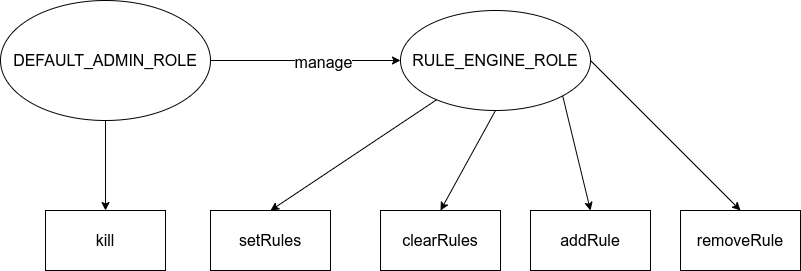
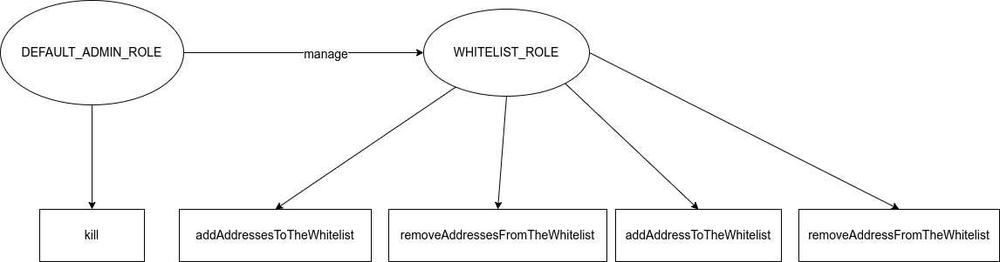

# Technical choice

## Access Control
whitelist 
The default admin is the Deployer/issuer. It is set when the contract is deployed in the constructor.
RuleEngine
The default admin is the Deployer/issuer. It is set when the contract is deployed in the constructor.
Here a schema of the Access Control.
**RuleEngine**

**RuleWhitelist**

## Upgradable
The Rule Engine and the whitelist are not upgradeable. The reason is the following:
If we need a new on, we just issue a new one, and tell the token to use the new. This would happen if we need more than just whitelisting, for ex.
 
## Urgency mechanism
* Pause
There are no functionalities to put in pause the contracts.
* Kill
The whitelist and the RuleEngine contracts have a function kill to destroy the bytecode of the contract.

##Whitelist
 
### Add/remove addresses
To add /remove an address
* addAddress(address)
* removeAddress(address)
To add /remove several addresses
* addAddresses(addresses[])
* removeAddresses(addresses[])

### Null address
It is possible to add the null address (0x0) to the whitelist. It is a requirement from the CMTAT to be able to mint tokens.

It is not a security problem because OpenZeppelin doesn't autorize the transfer of tokens to the zero address.

### Duplicate address

**addAddress**
If the address already exists, the transaction is reverted to save gas.
**addAddresses**
If the address already exists, there is no change for this address. The transaction remains valid (no revert).

### NonExistent Address
**removeAddress**
If the address does not exist in the whitelist, the transaction is reverted to save gas.
**removeAddresses**
If the address does not exist in the whitelist, there is no change for this address. The transaction remains valid (no revert).

