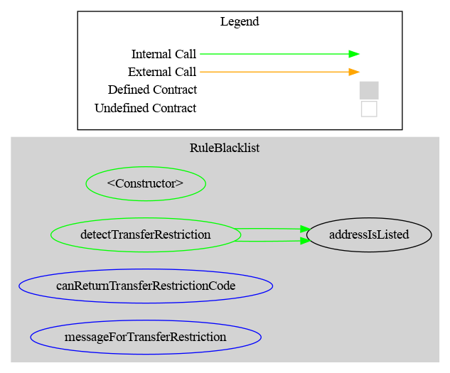
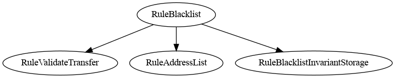
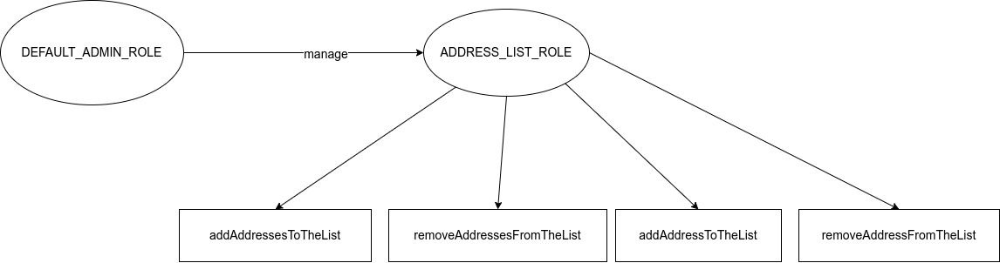

# Rule Blacklist

[TOC]

This rule can be used to forbid transfer from/to addresses in the blacklist
A part of the code is shared with Rule Whitelist

## Schema

### Graph

### Inheritance

## Access Control

### Admin

The default admin is the address put in argument(`admin`) inside the constructor. It is set in the constructor when the contract is deployed.

### Schema

Here a schema of the Access Control.

## Methods

### Null address
It is possible to add the null address (0x0) to the blacklist. If it is the case, it will not be possible to mint and burn tokens.

### Duplicate address

**addAddress**
If the address already exists, the transaction is reverted to save gas.
**addAddresses**
If one of addresses already exist, there is no change for this address. The transaction remains valid (no revert).

### NonExistent Address
**removeAddress**
If the address does not exist in the whitelist, the transaction is reverted to save gas.
**removeAddresses**
If the address does not exist in the whitelist, there is no change for this address. The transaction remains valid (no revert).
