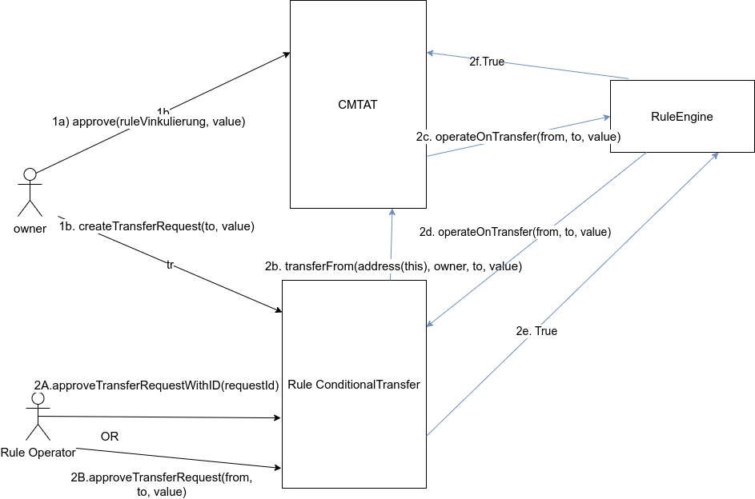
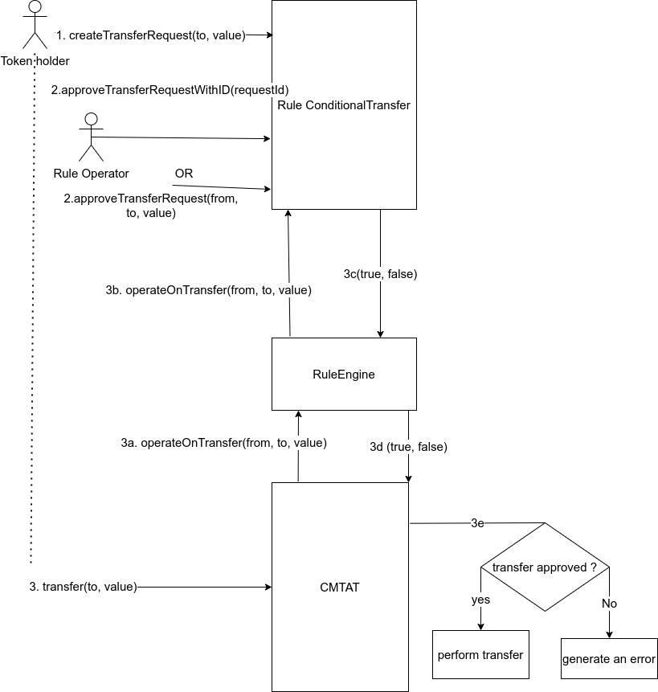

# Rule ConditionalTransfer

[TOC]

This page describes a Conditional Transfer implementation. This rule requires that transfers have to be approved before being executed by the token holders.

In the Swiss law, this rule allows to implement a specific restriction called *Vinkulierung*.

## Introduction

The ConditionalTransfer rule has been implemented as an operation rule with the RuleEngine

Why use a dedicated rule instead of directly implementing the solution directly in the CMTAT ?

1. This feature is not a standard features common to all tokens. 
2. The CMTAT is curently too “heavy” and its contract code size is close to the maximum size limit (if the snapshot module is included), it is not possible to include new features inside.
3. With the new version of the RuleEngine, it is now possible to update the storage of a rule during a transfer call from the CMTAT by using an operation rule.

### Swiss Law requirement

- The Swiss law defines that if the transfer is not approved or denied within three months, the request is considered as approved.

This option can be activated by setting the option `AUTOMATIC_APPROVAL` in the rule

- Not required by the Swiss Law, but upon request, we have also added the option to perform automatically a transfer if the transfer request is approved.

This option can be activated by setting the option `AUTOMATIC_TRANSFER` in the rule.

## Configuration

### Options/Parameters

At the rule issuance, the operator has different options to customize the behavior of the rule.

All these parameters can be updated after deployment.

| **Struct name**      | **Parameter**                      | **Description**                                              |
| :------------------- | :--------------------------------- | :----------------------------------------------------------- |
| `AUTOMATIC_TRANSFER` |                                    | Manage automatic transfer                                    |
|                      | `isActivate`                       | Activate automatic transfer                                  |
|                      | cmtat                              | CMTAT token contract                                         |
| `ISSUANCE`           |                                    |                                                              |
|                      | `authorizedMintWithoutApproval`    | Authorize mint without the need of approval                  |
|                      | `authorizedBurnWithoutApproval`    | Authorize burn without the need of approval                  |
| `TIME_LIMIT`         |                                    |                                                              |
|                      | `timeLimitToApprove`               | Time to approve a request(e.g 7 days)                        |
|                      | `timeLimitToTransfer`              | Time to perform a transfer after the approval (e.g 30 days)  |
| `AUTOMATIC_APPROVAL` |                                    |                                                              |
|                      | `isActivate`                       | Activate automatic approval                                  |
|                      | `timeLimitBeforeAutomaticApproval` | Time limit before an approval is “automatically” approved. In this case, it is possible to perform the transfer with a status request to WAITING |

### Conditional Whitelist

There is the possibility to add a Rule whitelist. If `from`and `to` are in the whitelist, a CMTAT transfer will be authorized by the rule without an approved requestTransfer.

The function to call is `setConditionalWhitelist`.

### Automatic transfer after approval

This option, if activated, will perform the transfer if the request is approved by the rule operator.

To perform the transfer, the token holder has to `approve` the rule to spend tokens on his behalf (standard ERC-20 approval). If the allowance is not sufficient, the request will be approved, but without performing the transfer.

## Schema

### Graph

### Inheritance

### Workflow

#### Status

Each request has a status, which changes regarding the decision of the operator

The default status is `NONE`.

#### With the CMTAT

#### With Storage

## Request

- Each request has a status and a list of corresponding attributes.

### Status

| **Status** | **Description**                                              |
| :--------- | :----------------------------------------------------------- |
| NONE       | Default status \|\| the request has been reset by an operator \|\| the request has been cancelled by the token holder. |
| WAIT       | The request is waiting for an approval                       |
| APPROVED   | The request has been approved                                |
| DENIED     | The request has been denied                                  |
| EXECUTED   | The request has been executed, which means a successful CMTAT transfer |

 

### Attributes

| Name      | **Description**                                              |
| :-------- | :----------------------------------------------------------- |
| `key`     | Each request is identified with three elements: `from`, address `to` and `value`.  From these three elements, a `key` is computed with the one-way hash function *Keccak-256.* |
| `id`      | Each request has a unique identifier. Starts from zero       |
| `from`    | Token holder                                                 |
| `to`      | Token receiver                                               |
| `valu`e   | `value` amount of tokens to transfer                         |
| `askTime` | Date where the request has been created by the token holder  |
| `maxTime` | date limit to perform the transfer after approval            |
| `status`  | `request status`                                             |

### Initiate by the token holder(sender)

1. The sender calls the contract rule to perform a request of transfer under the form of

"to | value"

=> Status Wait

2. The rule operator has to validate the request

"sender, recipient, amount, date"

=> Status Approved

3. The sender then makes the transfer by calling the corresponding function from the CMTAT.

a. Before performing the transfer, the CMTAT calls the RuleEngine. The RuleEngine checks the request by calling the corresponding rule

 => if the request is valid, the transfer is valid and the ruleEngine will return True to the CMTAT AND the status of the transferRequest is set to `Exectuted`.

The rest of the transaction is performed inside the CMTAT.

=> Status Executed

### Initiate by the operator

1. The rule operator creates and validates the request : `from | to | value`

=> Status Approved

2. The token holder then makes the transfer by calling the corresponding function from the CMTAT

=> Status Executed

## Access Control

The default admin is the address put in argument(`admin`) inside the constructor. It is set in the constructor when the contract is deployed.

| Name                                    | Description                                                  |
| --------------------------------------- | ------------------------------------------------------------ |
| DEFAULT_ADMIN_ROLE                      | Manage all the roles                                         |
| RULE_CONDITIONAL_TRANSFER_OPERATOR_ROLE | Approve request and manage options. Functions defined in the contract RuleConditionalTransferOperator setAutomaticTransfer setIssuanceOptions setTimeLimit setAutomaticApproval createTransferRequestWithApproval approveTransferRequest approveTransferRequestWithId |

### Graph

## Time Condition

- Once a request is `Approved`, the token holder has a date limit (e.g. 7 days) to perform the transfer. After that, he has to begin the whole process again. This parameter can be changed by the rule operator.
- Once a request is created `Wait`, the operator has a date limit (e.g. 7 days) to  approve the transfer. After that, the token holder has to begin the whole process again. This parameter can be changed by the rule operator.

# FAQ

> With transferFrom, what is the corresponding workflow ?

With `transferFrom`, the sender, which has the approval from the token holder, is not part of the Vinkulierung workflow. Thus, a valid request for “from, to, value” has to exist.

There is no control performed on the sender of the `transferFrom` call

> Can I create several transfer requests with the same value/amount?

No, it is not possible since each request has a key under the form of 

`hash(from, to, value`)
