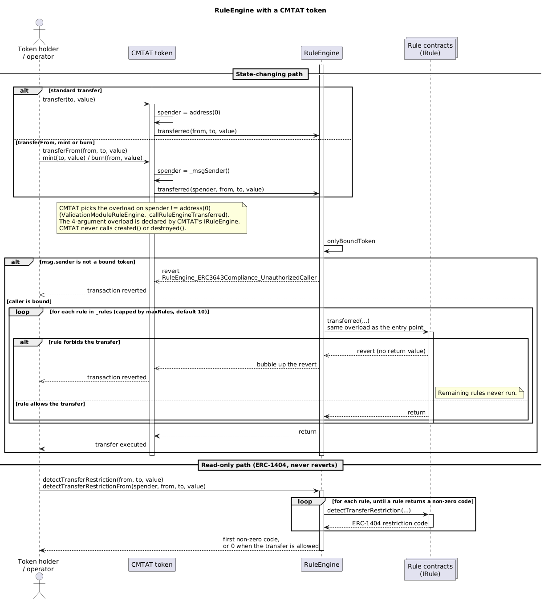

# Using the RuleEngine with a CMTAT token

How to attach a RuleEngine to a [CMTAT](https://github.com/CMTA/CMTAT) token, which entry points CMTAT
actually calls, how to configure both sides, and the limitations to know about before deploying.

For the ERC-3643 equivalent, see [RuleEngine-with-ERC3643.md](./RuleEngine-with-ERC3643.md). The two token
standards drive **disjoint entry points** on the engine — that distinction is the single most important thing
to carry between these documents.

## 1. Flow



_Diagram source: [doc/schema/plantuml/ruleengine-flow-cmtat.puml](../schema/plantuml/ruleengine-flow-cmtat.puml)._

## 2. Which entry points CMTAT uses

CMTAT calls **`transferred`** for every state-changing operation, and picks between two overloads according to
whether the operation has a spender. The choice is made in
`ValidationModuleRuleEngine._callRuleEngineTransferred`:

```solidity
if (spender != address(0)) {
    ruleEngine_.transferred(spender, from, to, value);   // 4-argument
} else {
    ruleEngine_.transferred(from, to, value);            // 3-argument
}
```

The `spender` value comes from `CMTATBaseCommon`:

| CMTAT operation | spender passed | Overload called |
|---|---|---|
| `transfer(to, value)` | `address(0)` | **3-argument** `transferred(from, to, value)` |
| `transferFrom(from, to, value)` | `_msgSender()` | 4-argument `transferred(spender, from, to, value)` |
| `mint(to, value)` | `_msgSender()` | 4-argument, with `from == address(0)` |
| `burn(from, value)` | `_msgSender()` | 4-argument, with `to == address(0)` |

Two consequences worth internalising:

- A **plain transfer never carries a spender**. The zero address is a branch condition inside CMTAT and is
  never forwarded, so the engine is never called with a zero spender.
- Since CMTAT v3.3.0, **mint and burn go through the 4-argument overload** with the operator as `spender`.
  A rule that rejects unknown spenders must skip or adapt that check when `from == address(0)` (mint) or
  `to == address(0)` (burn), or it will block issuance and redemption.

**CMTAT never calls `created()` or `destroyed()`.** Those belong to `IERC3643Compliance` and are used only by
ERC-3643 tokens. The 4-argument `transferred` is conversely declared by CMTAT's `IRuleEngine` and is never
reached by an ERC-3643 token.

### Read-only path

CMTAT exposes the ERC-1404 view path, which the engine answers by iterating the same rules and returning the
**first non-zero** restriction code:

- `detectTransferRestriction(from, to, value)` / `canTransfer(from, to, value)`
- `detectTransferRestrictionFrom(spender, from, to, value)` / `canTransferFrom(spender, from, to, value)`
- `messageForTransferRestriction(code)` — resolves the code against the rule that claims it

## 3. Configuration

### 3.1 Deploy the RuleEngine

Three deployable variants share identical core logic and differ only in access control. Pick one:

| Contract | Access control | Use case |
|---|---|---|
| `RuleEngine` | Role-based (`AccessControlEnumerable`) | Multiple operators, granular permissions |
| `RuleEngineOwnable` | ERC-173 `Ownable` | Single owner |
| `RuleEngineOwnable2Step` | ERC-173 `Ownable2Step` | Single owner, safer handover |

```solidity
// admin, trusted ERC-2771 forwarder (address(0) to disable gasless), token to bind (may be address(0))
RuleEngine engine = new RuleEngine(admin, forwarder, address(0));
```

The forwarder is **immutable** — it is fixed at construction and cannot be changed afterwards.

### 3.2 Bind the token to the engine

Only bound tokens may call `transferred`. Binding is a privileged operation on the engine:

```solidity
engine.bindToken(address(cmtat));    // COMPLIANCE_MANAGER_ROLE, or owner on the ownable variants
```

You can also pass the token as the third constructor argument to bind it at deployment.

CMTAT does **not** self-bind — unlike ERC-3643's `setCompliance`, `setRuleEngine` does not call back into the
engine. Binding is therefore always an explicit operator action, and the self-binding approval mechanism
(`setTokenSelfBindingApproval`) is not needed for CMTAT.

### 3.3 Point the token at the engine

Either at construction:

```solidity
ICMTATConstructor.Engine memory engines = ICMTATConstructor.Engine(IRuleEngine(address(engine)));
```

or afterwards, from `ValidationModuleRuleEngine`:

```solidity
cmtat.setRuleEngine(IRuleEngine(address(engine)));   // caller needs DEFAULT_ADMIN_ROLE on the token
```

### 3.4 Add rules

```solidity
engine.addRule(IRule(address(rule)));                  // RULES_MANAGEMENT_ROLE, or owner
engine.setRules(rulesArray);                           // replaces the whole set atomically
```

A rule must implement `IRule` and advertise `RuleInterfaceId.IRULE_INTERFACE_ID` (`0x2497d6cb`) through
ERC-165; the engine validates this on `addRule` and rejects anything else. Rules run **in declaration order**
and the first one to revert aborts the whole transaction.

### 3.5 Roles reference (`RuleEngine` variant)

| Role | Grants |
|---|---|
| `DEFAULT_ADMIN_ROLE` | Everything (the `hasRole` override makes the admin hold all roles), plus `setMaxRules` |
| `RULES_MANAGEMENT_ROLE` | `addRule`, `removeRule`, `setRules`, `clearRules` |
| `COMPLIANCE_MANAGER_ROLE` | `bindToken`, `unbindToken`, and the batch variants |

On `RuleEngineOwnable` / `RuleEngineOwnable2Step` all three collapse to `onlyOwner`.

## 4. Warnings and limitations

### 4.1 The rule set is iterated on every transfer

Every configured rule is called on every transfer, mint, burn **and** on every view call. Cost is O(number of
rules). An on-chain cap (`maxRules`, default **10**) bounds this; raising it re-exposes unbounded gas cost for
administrative operations such as `clearRules`. A single gas-heavy or misconfigured rule can make all
transfers fail.

### 4.2 The 3-argument view path fails open for spender-dependent rules

`detectTransferRestriction` and `canTransfer` carry no `spender`. A rule keyed by spender — a per-minter mint
allowance, a spender whitelist — cannot evaluate the operation on that path and must answer "no restriction".
The engine aggregates that answer, so **these two views can report an operation as allowed that the
state-changing path will revert**.

Use the 4-argument `detectTransferRestrictionFrom` / `canTransferFrom` to pre-check anything with an operator.
Recorded as finding `H-1` in
[CLAUDE_ANALYSIS.md](../security/audits/tools/v3.0.0-rc5/CLAUDE_ANALYSIS.md).

### 4.3 Address-list rules treat `address(0)` as a participant

**This concerns `RuleWhitelistMock`, a reference rule in `src/mocks/`, not a production rule.** Production
rules live in [CMTA/Rules](https://github.com/CMTA/Rules) and may handle the sentinel differently — check the
rule you actually deploy.

`RuleWhitelistMock` checks both endpoints without exempting the zero-address sentinel. Because CMTAT routes mint
through the 4-argument overload with `from == address(0)`, and the whitelist's `from`/`to` checks still apply,
**the zero address must be whitelisted for minting to be permitted**. Whitelisting only real holders silently
blocks issuance. Recorded as finding `F-2`.

### 4.4 One engine shared by several tokens is not neutral

An engine can be bound to multiple tokens, but the ERC-3643 callbacks **do not pass the token address to the
rules**. Any stateful rule that keeps per-address accounting therefore mixes state across every bound token.
Only bind tokens that are equally trusted and governed together. Unbinding does not retroactively separate
state already accumulated.

### 4.5 Restriction codes must be unique across the rule set

The engine returns the first non-zero code, and `messageForTransferRestriction` resolves a code against the
first rule claiming it. If two rules share a code they must return the same message, or operators get
inconsistent feedback. Keep the CMTAT-reserved ranges free.

### 4.6 Rules are trusted code

Rule contracts are called on every transfer and can revert or consume arbitrary gas. Treat them as trusted
business logic. Do not grant `RULES_MANAGEMENT_ROLE` to a rule contract — the engine blocks granting any role
to an address currently configured as a rule, but the check is one-directional and does not stop an already
privileged address from later being added as a rule.

## 5. What is tested

| Area | File | Tests |
|---|---|---|
| Engine + CMTAT (current) | `RuleEngine/RulesManagementModuleTest/CMTATIntegration.t.sol` | 3 |
| Engine + CMTAT v3.0.0 | `RuleEngine/RulesManagementModuleTest/CMTATIntegrationV3.t.sol` | 3 |
| Whitelist rule + CMTAT (current) | `RuleWhitelist/CMTATIntegration.t.sol` | 11 |
| Whitelist rule + CMTAT v3.0.0 | `RuleWhitelist/CMTATIntegrationV3.t.sol` | 11 |
| Reverting rule propagation | `RuleEngine/RulesManagementModuleTest/RuleEngineOperationRevert.t.sol` | 1 |
| Reverting rule, CMTAT v3.0.0 | `RuleEngine/RulesManagementModuleTest/RuleEngineOperationRevertV3.t.sol` | 1 |
| Deployment script | `script/CMTATWithRuleEngineScript.t.sol` | 1 |

**31 CMTAT-specific tests.** Coverage includes: a real `CMTATStandardStandalone` bound to the engine,
transfers accepted and rejected through the whitelist, restriction-code propagation back to the token, and a
rule that reverts mid-transfer.

**Backward compatibility is tested against two CMTAT versions.** The `…V3` suites deploy a real CMTAT
**v3.0.0** token (submodule `lib/CMTATv3.0.0`, remapped `CMTATv3.0.0/`) alongside the current
**v3.3.0-rc3** token (`lib/CMTAT`). Both are bound to the same engine implementation.

### Version compatibility

| RuleEngine | CMTAT |
|---|---|
| v3.0.0-rc5 | ≥ v3.0.0, target v3.3.0-rc3 |
| v3.0.0-rc4 | ≥ v3.0.0, target v3.3.0-rc1 |
| v1.0.2.1 | v2.3.0 (audited) |

## 6. Related documents

- [RuleEngine-with-ERC3643.md](./RuleEngine-with-ERC3643.md) — the ERC-3643 counterpart
- [../README.md](../README.md) — full interface and API reference
- [CLAUDE_ANALYSIS.md](../security/audits/tools/v3.0.0-rc5/CLAUDE_ANALYSIS.md) — code-quality review, findings `H-1` and `F-2`
- Production rules: [github.com/CMTA/Rules](https://github.com/CMTA/Rules)
