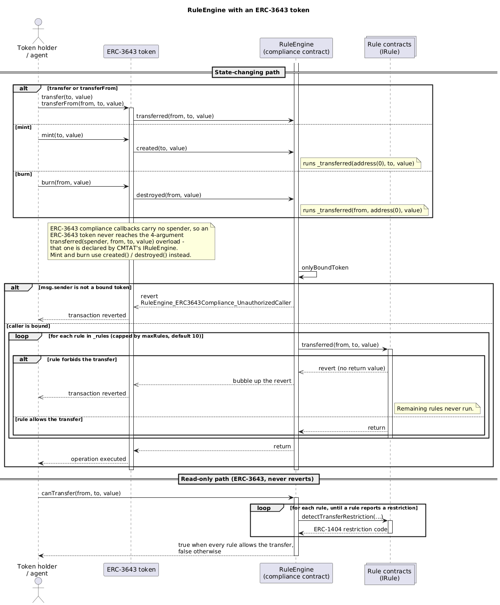

# Using the RuleEngine with an ERC-3643 token

How to attach a RuleEngine to an [ERC-3643](https://eips.ethereum.org/EIPS/eip-3643) (T-REX) token as its compliance contract, which entry points the token actually calls, how to configure the self-binding handshake, and the limitations to know about before deploying.

For the CMTAT equivalent, see [RuleEngine-with-CMTAT.md](./RuleEngine-with-CMTAT.md). The two standards drive
**disjoint entry points** on the engine, so a rule or an integration written against one does not
automatically hold for the other.

## 1. Flow



_Diagram source: [doc/schema/plantuml/ruleengine-flow-erc3643.puml](../schema/plantuml/ruleengine-flow-erc3643.puml)._

## 2. Which entry points an ERC-3643 token uses

In ERC-3643 the RuleEngine plays the role of the **compliance contract**. Taken from `Token.sol` in the reference implementation (submodule `lib/ERC-3643`, tag 4.1.3):

| Token operation | Pre-check | State-changing callback |
|---|---|---|
| `transfer(to, amount)` | `canTransfer(msg.sender, to, amount)` | `transferred(msg.sender, to, amount)` |
| `transferFrom(from, to, amount)` | `canTransfer(from, to, amount)` | `transferred(from, to, amount)` |
| `forcedTransfer(from, to, amount)` | — | `transferred(from, to, amount)` |
| `mint(to, amount)` | `canTransfer(address(0), to, amount)` | `created(to, amount)` |
| `burn(from, amount)` | — | `destroyed(from, amount)` |
| `setCompliance(newCompliance)` | — | `unbindToken(this)` then `bindToken(this)` |

Two consequences follow:

- **ERC-3643 compliance callbacks carry no spender.** An ERC-3643 token therefore *never* reaches the
  4-argument `transferred(spender, from, to, value)` overload — that one is declared by CMTAT's `IRuleEngine`,
  not by ERC-3643. Everything goes through the 3-argument form.
- **Mint and burn use dedicated entry points**, `created` and `destroyed`, rather than `transferred`. Inside
  the engine both run the same 3-argument rule loop:
  `created(to, value)` → `_transferred(address(0), to, value)`, and
  `destroyed(from, value)` → `_transferred(from, address(0), value)`.

Note the mint pre-check passes `address(0)` as the origin. That single detail drives two of the limitations in
section 4.

## 3. Configuration

### 3.1 Deploy the RuleEngine

Same three variants as for CMTAT. ERC-3643's own specification points at ERC-173 for ownership:

> The standard relies on ERC-173 to define contract ownership, with the owner having the responsibility of setting the Compliance parameters and binding the Compliance to a Token contract.

so `RuleEngineOwnable` or `RuleEngineOwnable2Step` is the closest match to the spec, though `RuleEngine` (role-based) works identically and is preferable with multiple operators.

```solidity
RuleEngineOwnable engine = new RuleEngineOwnable(owner, forwarder, address(0));
```

### 3.2 Grant self-binding approval — required before `setCompliance`

`Token.setCompliance` makes the **token** call `bindToken` and `unbindToken` on the compliance contract, not
the operator:

```solidity
function setCompliance(address _compliance) public override onlyOwner {
    if (address(_tokenCompliance) != address(0)) {
        _tokenCompliance.unbindToken(address(this));
    }
    _tokenCompliance = IModularCompliance(_compliance);
    _tokenCompliance.bindToken(address(this));
    emit ComplianceAdded(_compliance);
}
```

To support that without letting arbitrary contracts bind themselves, the engine gates self-binding behind an explicit approval:

```solidity
engine.setTokenSelfBindingApproval(address(token), true);   // COMPLIANCE_MANAGER_ROLE, or owner
engine.isTokenSelfBindingApproved(address(token));          // -> true
```

**Recommended operational sequence:**

1. On the target engine, grant self-binding approval for the token.
2. Call `token.setCompliance(address(engine))`.
3. Optionally revoke the approval afterwards if no further migration is expected.

Without step 1, `setCompliance` reverts. This is exercised by
`testSetComplianceRevertsWithoutSelfBindingApproval`.

An operator can equally bind the token directly with `engine.bindToken(address(token))` and skip the approval entirely — self-binding approval exists specifically to support the T-REX `setCompliance` pattern.

### 3.3 Migrating between engines

`setCompliance` unbinds from the old compliance and binds to the new one in a single transaction. The **new** engine must have granted self-binding approval for the token before the call; the old one does not need it still granted for the unbind to succeed. 

Verified by `testSetComplianceUnbindsThePreviousEngine`.

### 3.4 Add rules

Identical to the CMTAT case:

```solidity
engine.addRule(IRule(address(rule)));
```

Rules must implement `IRule` and advertise `RuleInterfaceId.IRULE_INTERFACE_ID` via ERC-165. They run in declaration order; the first to revert aborts the transaction.

### 3.5 Batch helpers

The extended compliance module adds operator-side batch operations:

```solidity
engine.bindTokens(tokens);                             // bind several tokens
engine.unbindTokens(tokens);
engine.setTokenSelfBindingApprovalBatch(tokens, true);
engine.getTokenBounds();                               // every bound token
```

### 3.6 Where binding is implemented

The binding registry itself is standard-agnostic and lives in `TokenBindingModule` /
`TokenBindingExtendedModule`; `ERC3643ComplianceModule` / `ERC3643ComplianceExtendedModule` are thin
ERC-3643 adapters over it, adding `getTokenBound()` and the compliance manager vocabulary. This matters
here only for reading the code and for reusing the registry elsewhere: the engine's external API is
unchanged. See [TokenBinding-module.md](./TokenBinding-module.md).

## 4. Warnings and limitations

### 4.1 The mint pre-check fails open for spender-dependent rules

`Token.mint` pre-checks with `canTransfer(address(0), _to, _amount)`. That signature carries **no spender**, so a rule keyed by spender — a per-minter allowance, for instance — cannot evaluate the mint and must answer "no restriction". 

The engine aggregates that answer, so the pre-check reports the mint as allowed even when a spender-aware rule would reject it.

The state-changing path is unaffected and still enforces correctly; the damage is to anything that trusts the pre-check. Pinned by `testMintPreCheckFailsOpenForSpenderKeyedRule`, and recorded as finding `H-1` in [CLAUDE_ANALYSIS.md](../security/audits/tools/v3.0.0-rc5/CLAUDE_ANALYSIS.md).

### 4.2 `address(0)` must be whitelisted for minting to work

**This concerns `RuleWhitelistMock`, a reference rule in `src/mocks/`, not a production rule.** Production rules live in [CMTA/Rules](https://github.com/CMTA/Rules) and may handle the sentinel differently — check the
rule you actually deploy.

The behavior is described here because the mock is what the examples, scripts and tests in this repository use, and because integrators copy it.

`RuleWhitelistMock` treats the zero address as an ordinary participant:

```solidity
if (!addressIsListed(from)) { return CODE_ADDRESS_FROM_NOT_WHITELISTED; }
```

Because the mint pre-check passes `address(0)` as `from`, **an issuer who whitelists only real holders cannot mint at all** — every mint is refused with `CODE_ADDRESS_FROM_NOT_WHITELISTED`. Whitelist `address(0)` explicitly to permit issuance.

Pinned by `testMintIsBlockedWhenZeroAddressNotListed`, recorded as finding `F-2`.

### 4.3 One engine shared by several tokens is not neutral

The ERC-3643 callbacks **do not pass the token address to the rules**, so a stateful rule that keeps
per-address accounting mixes state across every bound token. 

- Only bind tokens that are equally trusted and governed together. 
- Unbinding does not retroactively separate state already accumulated in a rule.

This matters more here than for CMTAT, because `bindTokens` makes multi-token binding a one-call operation.

### 4.4 The rule set is iterated on every operation

O(number of rules) on every transfer, mint, burn and view call, capped by `maxRules` (default **10**). 

A gas-heavy rule affects every operation on every bound token.

### 4.5 Only bound tokens may call the callbacks

`transferred`, `created` and `destroyed` all revert with
`TokenBinding_UnauthorizedCaller` for any caller that is not a bound token. Verified by
`testUnboundCallerCannotCallTransferred` and `testUnboundCallerCannotCallCreatedOrDestroyed`.

### 4.6 Restriction codes must be unique across the rule set

As with CMTAT: the engine returns the first non-zero code, so overlapping codes across rules produce inconsistent operator feedback unless they share the same message.

### 4.7 ERC-7551 support is a draft subset

`IERC7551Compliance` comes from `draft-IERC7551` and is not final. This project implements a subset focused on
`canTransferFrom`. Do not assume full ERC-7551 conformance.

### 4.8 The reference T-REX token cannot be compiled into this test suite

Relevant if you intend to add tests against the vendored implementation in `lib/ERC-3643`. Three independent blockers:

- it pins `pragma solidity 0.8.17` (exact), while this project compiles with **0.8.36**;
- it requires **OpenZeppelin 4.8.x**, while this project uses **5.7.0**;
- it imports the `onchain-id/solidity` package, which is not installed here.

Attempting it fails at resolution:

```
Error: Encountered invalid solc version in lib/ERC-3643/contracts/token/Token.sol:
No solc version exists that matches the version requirement: =0.8.17
```

The integration tests therefore use `ERC3643TokenMock`, whose compliance interaction is copied from the reference `Token.sol` (the table in section 2 is taken from it directly). Compiling the real token would require unpinning the project compiler and vendoring a second OpenZeppelin major alongside the current one.

## 5. What is tested

| Area | File | Tests |
|---|---|---|
| Compliance module, RBAC variant | `RuleEngine/ERC3643Compliance.t.sol` | 30 |
| Compliance module, ownable variant | `RuleEngineOwnable/ERC3643Compliance.t.sol` | 29 |
| End-to-end with an ERC-3643 style token | `RuleEngine/ERC3643TokenIntegration.t.sol` | 11 |

**70 ERC-3643-specific tests.** The `RuleEngineOwnable2Step` suite exercises the same compliance surface again
through its own variant.

The end-to-end suite covers, using a token that drives the engine exactly as `Token.sol` does:

- `setCompliance` binding the token, and unbinding a previous engine on migration
- `setCompliance` reverting without self-binding approval
- transfers accepted and rejected through the whitelist rule, via `transferred`
- mint through `created` and burn through `destroyed`
- `transferred` / `created` / `destroyed` rejecting unbound callers
- the two documented limitations above (`H-1` fail-open, `F-2` zero-address whitelist), pinned so a change in
  behaviour is noticed

## 6. Related documents

- [RuleEngine-with-CMTAT.md](./RuleEngine-with-CMTAT.md) — the CMTAT counterpart
- [TokenBinding-module.md](./TokenBinding-module.md) — the standard-agnostic binding registry underneath
- [../README.md](../README.md) — full interface and API reference
- [CLAUDE_ANALYSIS.md](../security/audits/tools/v3.0.0-rc5/CLAUDE_ANALYSIS.md) — code-quality review, findings `H-1` and `F-2`
- Production rules: [github.com/CMTA/Rules](https://github.com/CMTA/Rules)
