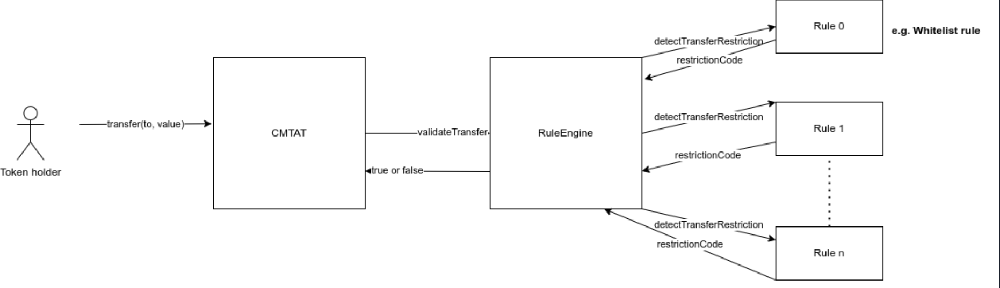
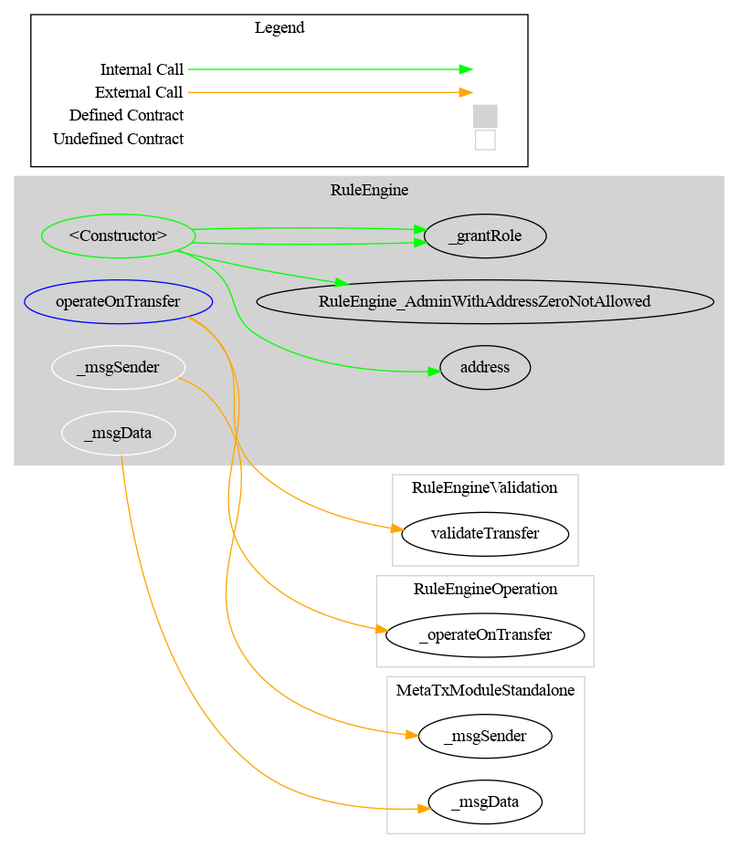
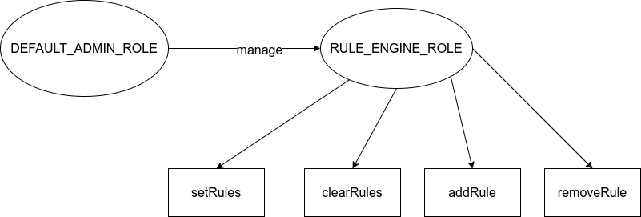

# RuleEngine

[TOC]

The RuleEngine is an external contract used to apply transfer restriction to the CMTAT.

This contract acts as a controller and can call different contract rule to apply rule on each transfer.

A possible rule is a whitelist rule where only the address inside the whitelist can perform a transfer

## Schema

### Graph

## Access Control

### Admin

The default admin is the address put in argument(`admin`) inside the constructor. It is set in the constructor when the contract is deployed.

### Schema

Here a schema of the Access Control.

## Methods

### Duplicate rules

**setRules**

If one rule is already present, the function is reverted

**addRule** 

If one rule is already present, the function is reverted

### Null address

**setRules**

The function is reverted if one rule is the zero address

**addRule** 

The function is reverted if one rule is the zero address

https://github.com/ethereum/solidity/issues/10698)
