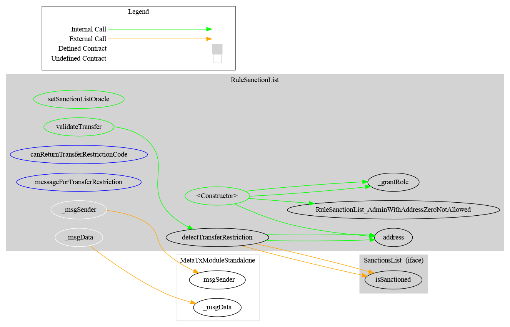
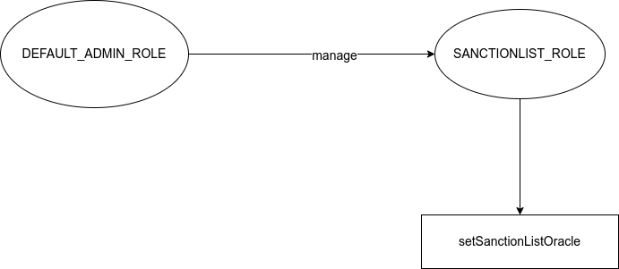

# Rule SanctionList

[TOC]

This document defines the rule SanctionList

## How to use

The purpose of this contract is to use the oracle contract from Chainalysis to forbid transfer from/to an address  included in a sanctions designation (US, EU, or UN).

The documentation and the contracts addresses are available here: [Chainalysis oracle for sanctions screening](https://go.chainalysis.com/chainalysis-oracle-docs.html)

## Schema

### Graph

### SanctionList

## Access Control

### Admin

The default admin is the address put in argument(`admin`) inside the constructor. It is set in the constructor when the contract is deployed.

### Schema

Here a schema of the Access Control.

**RuleSanctionList**

