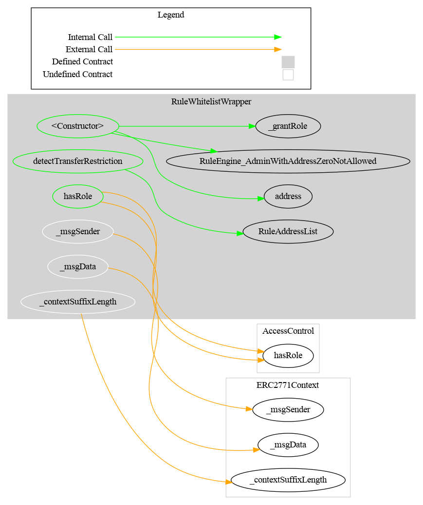

# Rule Whitelist Wrapper

[TOC]

This rule allows to have several different whitelist rules, managed by different operators.

The rule will call each whitelist rule to know if during a transfer the address `from`or the address `to`is in the whitelist.
If this is the case, the rule return 0 (transfer valid) or an error otherwise.

## Schema

### Architecture

### Graph

### Inheritance

## Details

### Architecture

This rule inherits from `RuleEngineValidationCommon`. Thus the whitelist rules are managed with the same architecture and code than for the ruleEngine. For example, rules are added with the functions `setRulesValidation` or `addRuleValidation`.

### Admin

The default admin is the address put in argument(`admin`) inside the constructor. It is set in the constructor when the contract is deployed.
