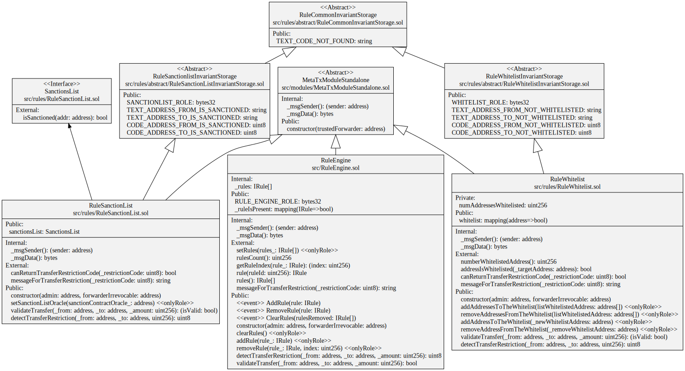

# Technical choice

[TOC]

## Schema

### UML




## Functionality

### Upgradeable

The Rule Engine, the Rule Whitelist and the Rule SanctionList contracts are not upgradeable. The reason is the following:
If we need a new on, we just issue a new one, and tell the CMTAT token (or the RuleEngine for the rules) to use the new. This would happen if we need more than just whitelisting, for ex.

### Urgency mechanism
* Pause
  There are no functionalities to put in pause the contracts.

* We have removed the possibility to Kill the contracts,  to destroy the bytecode, from
  the different contracts (RuleEngine and Rule)  for the following reasons:

  * The opcode SELFDESTRUCT which the property of destroying the contract (= deletion of any storage keys or code) will be remove with the Cancun Upgrade, an upgrade of the Ethereum network.

    Therefore, when the Ethereum Network will integrate this upgrade, this functionality will no longer be available.

    See [https://eips.ethereum.org/EIPS/eip-6780](https://eips.ethereum.org/EIPS/eip-6780) & [https://github.com/ethereum/execution-specs/blob/master/network-upgrades/mainnet-upgrades/cancun.md](https://github.com/ethereum/execution-specs/blob/master/network-upgrades/mainnet-upgrades/cancun.md)

  * It was recommended by the audit team

    > Implementing an ability to destroy a contract is a bad practice, as it cause more risks than benefits.


### Gasless support

> The gasless integration was not part of the audit performed by ABDK on the version [1.0.1](https://github.com/CMTA/RuleEngine/releases/tag/1.0.1)

The RuleEngine, the Whitelist and SanctionList contracts support client-side gasless transactions using the [Gas Station Network](https://docs.opengsn.org/#the-problem) (GSN) pattern, the main open standard for transfering fee payment to another account than that of the transaction issuer. The contract uses the OpenZeppelin contract `ERC2771Context`, which allows a contract to get the original client with `_msgSender()` instead of the fee payer given by `msg.sender` .

At deployment, the parameter  `forwarder` inside the contract constructor has to be set  with the defined address of the forwarder. Please note that the forwarder can not be changed after deployment.

Please see the OpenGSN [documentation](https://docs.opengsn.org/contracts/#receiving-a-relayed-call) for more details on what is done to support GSN in the contract.

## Other

### Gas Optimization

Inside a loop, we use `uncheck` to increment to save gas because an array has a length of < 2\**256.
```
 unchecked { ++i; }
```
See [hackmd.io - gas-optimization-loops](https://hackmd.io/@totomanov/gas-optimization-loops) and [https://github.com/ethereum/solidity/issues/10698](https://github.com/ethereum/solidity/issues/10698)
