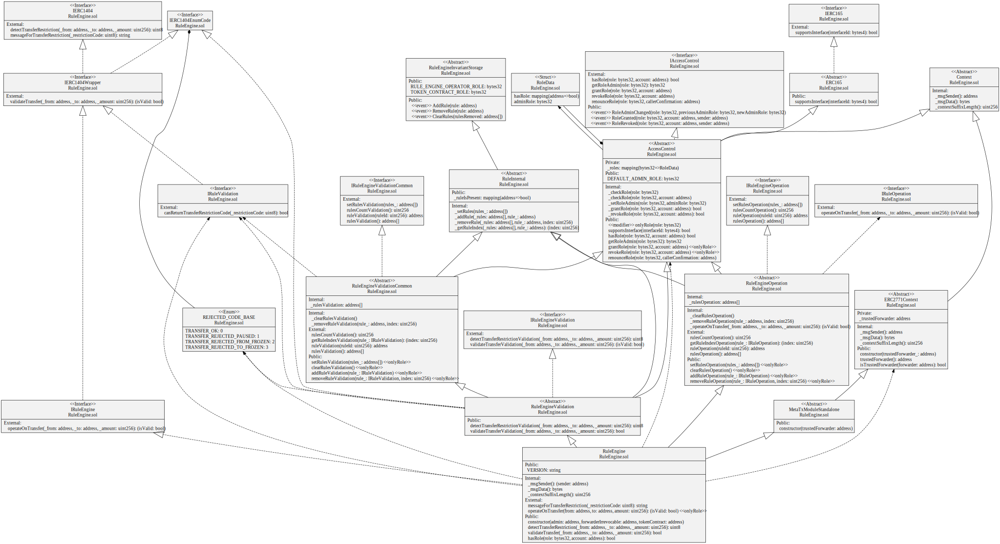

# Technical choice

[TOC]

## Schema

### UML

#### Global

> npm run-script uml

#### RuleEngine

> npm run-script uml:ruleEngine

## Functionality

### Upgradeable

The Rule Engine and the other rules are not upgradeable. The reason is the following:
If we need a new on, we just issue a new one, and set inside the CMTAT token (or the RuleEngine for the rules) to use the new. 

### Urgency mechanism
- Pause

There are no functionalities to put in pause the contracts.

* Kill / Deactivate the contracts

There are no functionalities to kill/deactivate the contracts.

### Gasless support (ERC-2771)

> The gasless integration was not part of the audit performed by ABDK on the version [1.0.1](https://github.com/CMTA/RuleEngine/releases/tag/1.0.1)

The RuleEngine contracts and the other rules support client-side gasless transactions using the [Gas Station Network](https://docs.opengsn.org/#the-problem) (GSN) pattern, the main open standard for transfering fee payment to another account than that of the transaction issuer. The contract uses the OpenZeppelin contract `ERC2771Context`, which allows a contract to get the original client with `_msgSender()` instead of the fee payer given by `msg.sender` .

At deployment, the parameter  `forwarder` inside the contract constructor has to be set  with the defined address of the forwarder. Please note that the forwarder can not be changed after deployment.

Please see the OpenGSN [documentation](https://docs.opengsn.org/contracts/#receiving-a-relayed-call) for more details on what is done to support GSN in the contract.
